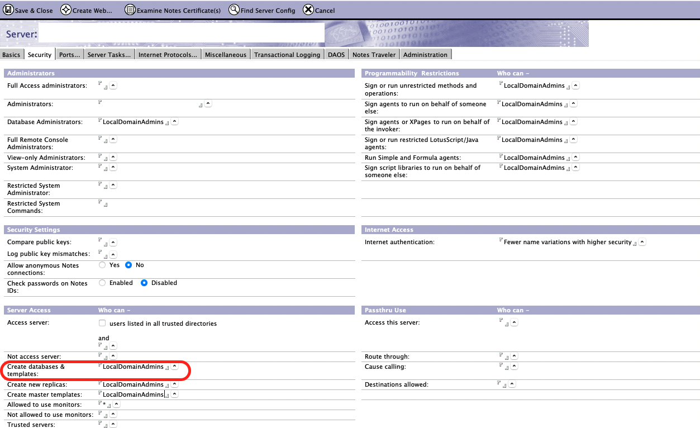

{::options parse_block_html="true" /}

This tutorial was created for a workshop for the Collabsphere 2021 conference and updated for the Domino REST API V1 release. It walks through creating two databases and working with the data from Node-RED. The Node-RED admin GUI will authenticate against Domino via Domino REST API. The databases are:

- A Contacts database with city and state. Totals per state will be projected onto a map.
- A Visitors database, where visitors to a company can check in and out.

Postman will also be used to set up the database.

### Pre-Requisites
The tutorial assumes already have a running Domino REST API installation and Postman installed. The tutorial will walk through setting up a Node-RED Docker container, but an existing Node-RED installation could be modified.

NOTE
{: .panel-heading}

Databases will be created programmatically, so ensure the user ID you are using has access to create databases on the server you're connecting to. This is managed on the server document

**DOWNLOADS REQUIRED**
{: .panel-heading}

You will need the following zip file for connecting Node-RED to Domino REST API.
<a href="../collabsphere21/downloads/DOMINORESTAPI-NODE-RED.zip">Node-RED Modifications ZIP</a>

**Note**
{: .panel-heading}

The tutorial will walk through creating Postman tests, but if you wish to cross-reference, you can download the <a href="../collabsphere21/downloads/collabsphere.postman_collection.json" target="_new">Postman Collection</a>

You can also download the <a href="../collabsphere21/downloads/flows.json" target="_new">Node-RED flows</a>. Note, you will need to install additional nodes, as detailed in the tutorial.

