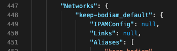
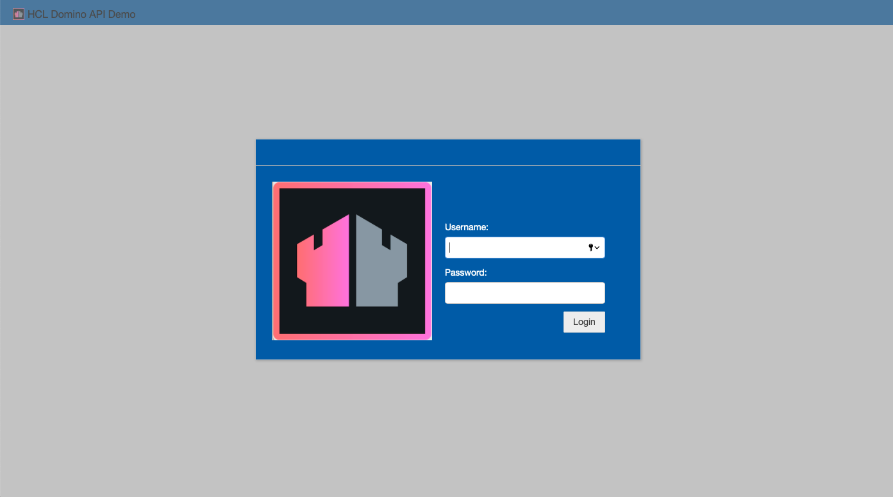

{::options parse_block_html="true" /}

<a href="https://nodered.org" target="_new">Node-RED</a> will be used to access the data from Domino REST API. Node-RED can be installed on any operating system and is also available as a Docker image. This tutorial will use a Docker image and modify the authentication to use Domino REST API to secure the admin console. However, an existing Node-RED installation can be modified.

### Downloads

You will need to download and extract <a href="../downloads/KEEP-NODE-RED.zip">Node-RED Docker ZIP</a>. You will find five files:
- **Dockerfile** for building the Docker image.
- **keepAuthentication.js** which will perform the authentication.
- **keepNewIcon.png** which will be used as the image for the Node-RED admin console.
- **keepTheme.css** which will be used to style the Node-RED admin console.
- **settings.js** which is the modified settings file for Node-RED.

### Authentication Explanation

The authentication file will perform authentication against a Domino server via Domino REST API. This is handled in the **authenticate** function starting on line 13. The location of the Domino server is passed in as an environment variable **AUTHENTICATION_HOST**. If you do not wish to use an environment variable, you can modify this line. 

The credentials used to log into Node-RED are then used for the rest of the flows. In a production scenario, you may wish an alternative approach for storing the credentials.

#### AUTHENTICATION_HOST Environment Variable

The value of AUTHENTICATION_HOST will need to be the URL to connect to your Domino REST API server from a Docker container:
- If the Domino REST API server has a DNS-enabled hostname, use that.
- If the Domino REST API server is installed on your operating system and running on the default port, "http://localhost:8880" should be used.
- If the Domino REST API server is running in Docker on your host machine, the standard Docker approach will work, i.e. PROTOCOL + CONTAINER_NAME + PORT, e.g. "http://domino-keep:8880".

### Docker

To create a Docker image, open a terminal window to the directory containing the Dockerfile and other files. Then issue the command `docker build -t node-red-keep-collabsphere:1.0.0 .` Remember the full stop at the end or it won't run. This starts from the latest Node-RED Docker image, copies the files across to the data directory and sets the required permissions.

You can now create a Docker container using the command `docker run -it -p 1880:1880 -e "AUTHENTICATION_HOST=http://MY.HOST.COM" --name nrCSphere21 node-red-keep-collabsphere:1.0.0`.

You will need to add the container to a network that your Domino server is in. This sounds complicated, but is not. If your Domino server was started using Docker Compose, it will already have a network created. To find out inspect the Docker container (`docker inspect CONTAINER_NAME`) and look at "Networks" near the bottom.


If there is a network, you can make a note of the name and issue the command `docker network connect NETWORK_NAME nrCSPhere21`.

If there is no network, you can create one called **csphere21** with the command `docker network create csphere21`. Then issue the command `docker network connect csphere21 nrCSPhere21` to connect your Node-RED Docker container to the network and repeat the process for your Domino Docker container, changing the container name at the end.

### Manual Modification

If you wish to modify an existing Node-RED installation, you will need to make the following changes to the **settings.js** file. When you start Node-RED the console log will tell you where to find this file.

#### Security
The "Security" section has been modified to call keepAuthentication for its authentication function. The following line has been added:
`adminAuth: require('./keepAuthentication'),`

"keepAuthentication.js" should be put in the same directory as the settings.js.

#### Editor Theme

The final change is to enable the new theme. This is near the bottom of the settings.js in the "Customising the editor" section. In the **editorTheme** object the following entries are added (add a comma after the last element). You will need to modify the filepaths to be **absolute filepaths for your operating system** for the relevant files.
```js
        page: {
			title: "HCL Domino API Demo",
			favicon: "/data/KeepNewIcon.png",
			css: "/data/keepTheme.css"
		},
		header: {
			title: "HCL Domino API Demo",
			image: "/data/KeepNewIcon.png",
		},
		login: {
			image: "/data/KeepNewIcon.png" // a 256x256 image
		}
```

You will need to set the environment variable for the Node-RED authentication to pick up, as detailed in <a href="#authentication_host-environment-variable">AUTHENTICATION_HOST Environment Variable</a>.

If everything has been done correctly, when you go to the Node-RED admin console (http://localhost:18880), you will see the following styling and login screen.

You will be able to authenticate against your Domino server.

