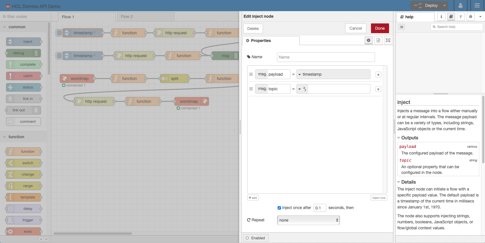
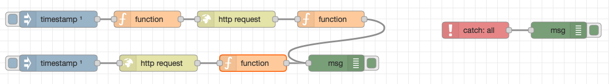

{::options parse_block_html="true" /}

The contacts populated into Domino will be displayed on a map in Node-RED. There are two pre-requisites flows we will add to Node-RED and, as part of this, get to know some of the basic nodes.

### Node-RED Introduction
Node-RED uses **nodes** wired to one another to perform granular actions (e.g. manipulate the payload, send an HTTP request, output a message to the console). Content is passed between nodes in a JSON object called **msg**. By convention **msg.payload** is where the key data is stored between requests.

The editor is split into three areas:
- the left-hand area is the palette and lists the nodes in categories.
- the central area is the canvas for each flow.
- the right-hand area is the sidebar and has tabs for information, help on the selected node and debug messages. The information tab will give details of inputs and outputs to the node. An editor flies out from this when double-clicking a node to allow you to view / modify that node's properties.

The **inject** node is used to trigger action, either on click or on startup. Here it will be used on startup.

The **function** node is used to manipulate the message payload via snippets of JavaScript. Typically this does not require advanced JavaScript skills, usually just the ability to access JavaScript objects in JavaScript variables.

The **http request** node is used to send an HTTP request, although parameters can be passed into the node.

The **catch** node is used to catch any unexpected errors.

The **debug** node is used to print to the Debug tab of the right-hand area of Node-RED. By default it will just print `msg.payload`, but often it is more useful to display the whole msg object.

### Authentication

1. Drag an **inject** node onto the canvas.
   - Tick "Inject once after 0.1 seconds"
2. Drag a **function** node onto the canvas.
   - On the **On Message** tab enter the JavaScript:
    
    ~~~js
    msg.payload = {
      "username": env.get("AUTHENTICATION_USERNAME"),
      "password": env.get("AUTHENTICATION_PASSWORD")
    };
    msg.url = env.get("AUTHENTICATION_HOST") + "/api/v1/auth";
    return msg;
    ~~~
    {: .code}
    
    This should be easy to follow, creating the payload for the authentication to Domino REST API and mapping to the same URL used in Postman. The payload is in the same format as Postman, but is retrieving from environment variables set when logging into Node-RED (as defined in **keepAuthentication.js**).
    - Wire the inject node to this function node.
3. Drag an **http request** node onto the canvas.
   - Change the **Method** to "POST" because authentication is a POST action.
   - Change the Return to "a parsed JSON object" so that Node-RED will automatically convert the response to a JSON object.
   - Wire the function node to this http request node.
4. Drag a **function** node onto the canvas.
   - On the **On Message** tab enter the following JavaScript to store the bearer token in the global object, for use across our flows:
     
    ~~~js
    global.set("AUTH_KEY", "Bearer " + msg.payload.bearer);
    return msg;
    ~~~
    {: .code}
    
   - Wire the http request node to this function node.
5. Drag a **debug** node onto the canvas.
   - Set the **Output** to "complete msg object".
   - Wire the function node to this debug node.
6. Drag a **catch** node onto the canvas. This does not need wiring to anything.
7. Drag a **debug** node onto the canvas.
   - Set the **Output** to "complete msg object".
   - Wire the catch node to this debug node.
8. Test the flow by clicking on the inject node.

If successful, the debug tab on the right area of Node-RED will display the output from the HTTP request, a statusCode 200 and a payload containing the bearer token.

If the request is unsuccessful, the errors property displays what went wrong.
{: .troubleshoot}

### Retrieving States Information

The map will need longitude and latitude of US states, retrieved according to the two-letter acronym for the state. A search of the internet found a gist on GitHub with this information at https://gist.githubusercontent.com/jpriebe/d62a45e29f24e843c974/raw/b1d3066d245e742018bce56e41788ac7afa60e29/us_state_capitals.json. This flow will retrieve that and store it for later use.

1. Drag an **inject** node onto the canvas.
   - Tick "Inject once after 0.1 seconds"
2. Drag an **http request** onto the canvas
   - The Method can remain as GET
   - Paste the URL above as the URL.
   - Change the Return to "a parsed JSON object" so that Node-RED will automatically convert the response to a JSON object.
   - Wire the inject node to this http request node.
3. Drag a **function** node onto the canvas.
   - On the **On Message** tab enter the following JavaScript to store the bearer token in the global object, for use across our flows:
     
     ~~~js
     flow.set('stateLongLat',msg.payload);
     return msg;
     ~~~
     {: .code}
     
   - Wire the http request node to this function node.
   - Wire this function node to the debug node created in step 6 of the Authentication, so that both flows end at the same function node.
4. Test the flow by clicking on the inject node.

If successful, the debug tab on the right area of Node-RED will display the output from the HTTP request, with payload being an object where the keys are the states and the value is another object containing its name, capital, latitude and longitude.

The final flow should look like this:
