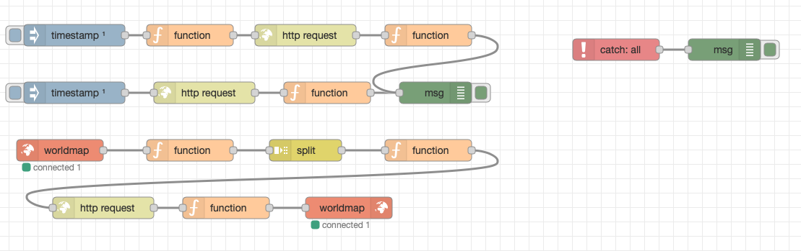

{::options parse_block_html="true" /}

All that remains is to add a final flow for aggregating all the information onto a world map. We will use custom worldmap nodes as well as the **split** node, which is used to split a payload into multiple messages. This will allow us to make a request via Domino REST API for each state key and plot a point onto the map with the number of contacts for that state.

### Installing World Map Node

1. Click on the menu top-right of Node-RED (the three lines).
2. Click "Manage Palette". This opens up the window for managing the user settings on the Palette tab.

3. Click on the "Install" tab.
4. In the search bar type "worldmap". This should bring up the **node-red-contrib-web-worldmap** node.
5. Click install.

New nodes will be installed in the palette on the left-hand area of Node-RED, under the "location" category.

### World Map Flow
1. Drag the **worldmap in** node onto the canvas.
2. Drag a **function** node onto the canvas.
   - On the **On Message** tab enter the JavaScript:
    
    ~~~js
    var states = flow.get("stateLongLat");
    msg.payload = states;
    return msg;
    ~~~
    {: .code}
    
    This loads the states object into the message payload ready for the next node.
   -  Wire the worldmap in node to this function node.
3. Drag a **split** node onto the canvas.
   - Tick "copy key to".
   - In the input box after "msg." enter `key`. This will ensure each state code can be accessed from msg.key.
   - Wire the function node to this split node.
4. Drag a **function** node onto the canvas. This will be used to take the key and seed the HTTP request to Domino REST API to retrieve the number of contacts for that state.
   - On the **On Message** tab enter the JavaScript:
    
    ~~~js
    msg.headers = {
        "Authorization": global.get("AUTH_KEY")
    }
    msg.url = env.get("AUTHENTICATION_HOST") + "/api/v1/lists/byState?db=collabsphere&key=" + msg.key;
    return msg;
    ~~~
    {: .code}
    
    This sets the authorization header and the URL. The URL consists of the AUTHENTICATION_HOST environment variable, the path to access the byState collection of entries in the KEEP Database "collabsphere", filtered by key on the state code, `msg.key` passed into this node.
   -  Wire the split node to this function node.
5. Drag an **http request** node onto the canvas.
   - Change the Return to "a parsed JSON object" so that Node-RED will automatically convert the response to a JSON object.
   - Write the function node to this http request node.
6. Drag a **function** node onto the canvas.
   - On the **On Message** tab enter the JavaScript:
    
    ~~~js
    var obj = {};
    var stateKey = msg.responseUrl.substr(msg.responseUrl.length - 2);
    var stateLongLatData = flow.get("stateLongLat")[stateKey];
    obj.name = stateLongLatData.name;
    obj.label = obj.name + ": " + msg.payload.length.toString();
    obj.lat = stateLongLatData.lat;
    obj.lon = stateLongLatData.long;
    obj.icon = "globe";
    obj.iconColor = "#FFDC02";
    msg.payload = obj;
    return msg;
    ~~~
    {: .code}
    
   - Wire the http request node to this function node.
7. Drag the **worldmap** node onto the canvas. This is the node that take input but has no output.
   - Set Latitude to 39.04.
   - Set Longitude to -95.69.
   - Set Zoom to 5.

Before testing, it will be useful to walk through the code added to the last function node.
- Line 1 creates a JavaScript object called obj, to hold the data to apply onto the map.
- Line 2 extracts the state code from the end of the responseUrl and stores it in stateKey variable.
- Line 3 gets the relevant state object from the stateLongLat flow variable initialized during setup.
- Line 4 copies across the name of the state.
- Line 5 sets the label to the name of the state and the length of the payload from Domino REST API - i.e. the number of entries for that state.
- Lines 6 and 7 set the latitude and longitude to plot on the map.
- Lines 8 and 9 set an icon and icon color.
- Line 10 writes this object as the payload to be plotted onto the world map.

You can test the map at http://localhost:1880/worldmap, the default endpoint on Node-RED for the world map node.

The full flows created so far should look like this:
