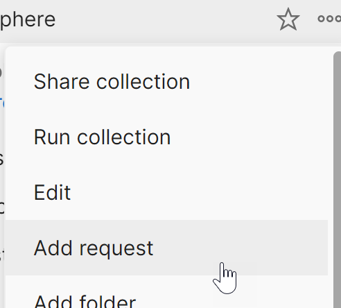

Now it is time to set up the authentication request. Hover on the collection and click on the ellipsis (three periods). Select the "Add request" menu option. 

With the request:
1. Rename it "Authentication".
2. Change "GET" to "POST"
3. As the Request URL enter "{{HOST}}/auth".
4. On the **Authorization** tab, set "Type" to "No Auth".
5. On the **Headers** tab, add a header "Content-Type" set to "application/json".
6. On the **Body** tab, select raw and enter:
    
    ~~~json
    {
      "username" : "{{USERNAME}}",
      "password" : "{{PASSWORD}}"
    }
    ~~~
    {: .code}
    
7. On the **Tests** tab, enter the following code:
    
    ~~~js
    var content = pm.response.json();
    pm.collectionVariables.set("TOKEN", content.bearer);
    ~~~
    {: .code}
    
8. Send the request.

Click on the Collabsphere collection again to open the collection contents. Check the **Variables** tab. The TOKEN variable should now have been set.

You can clear the username and password variables by adding the following code to the Tests tab. 

pm.collectionVariables.set("USERNAME", ""); 
pm.collectionVariables.set("PASSWORD", "");

 
This is good if you're sharing the Postman collection. It avoids accidentally sharing credentials. However, if you do this, you will need to enter the username and password, and save the Collection whenever authenticating.

The most common cause for errors is using the wrong HTTP verb (e.g. using the default "GET" instead of "POST).
{: .troubleshoot}
 
