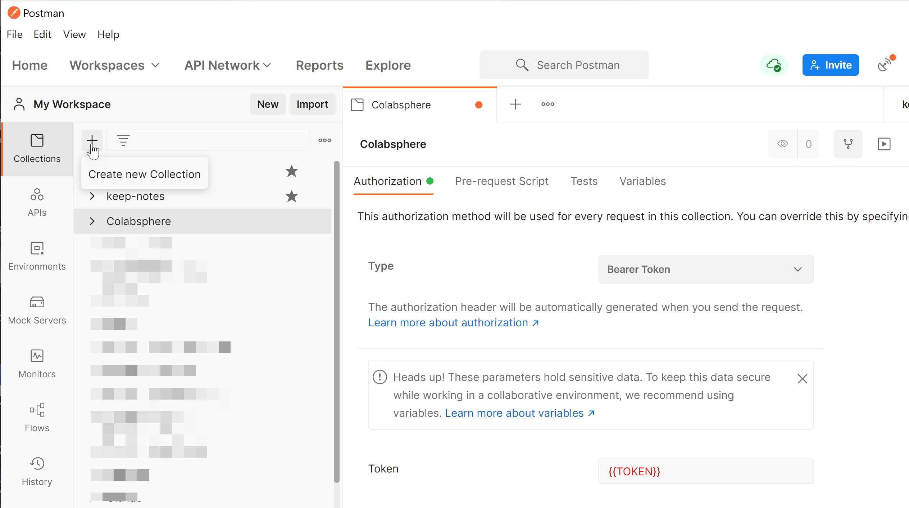
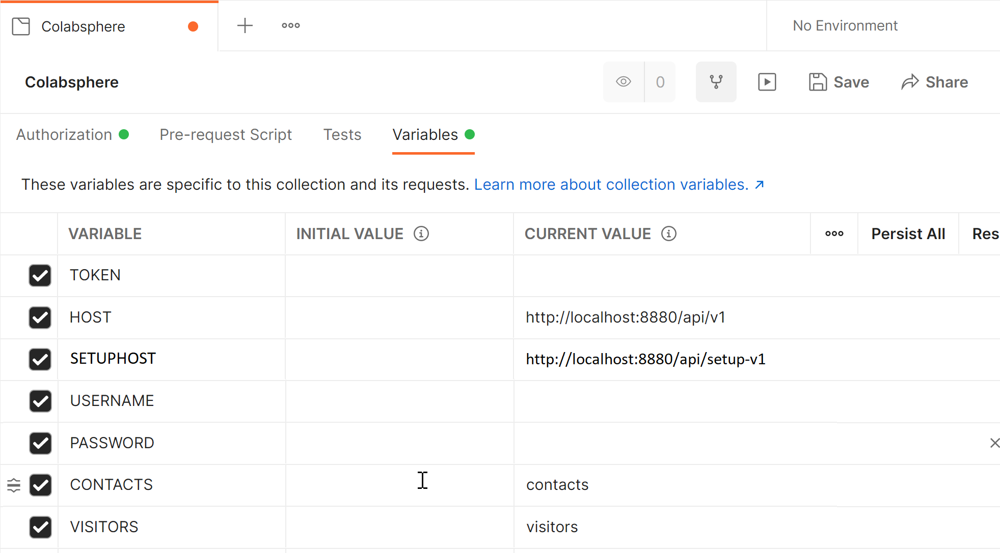

A Postman Collection will be used to keep the various requests together and share variables between them. 

1. In Postman, create a new Collection. Call it "Collabsphere".
2. On the **Authorization** tab set the "Type" to "Bearer Token". 
3. In the Token field, enter {{TOKEN}}.
  
4. On the Variables tab, add six variables.

    | Variable | Description | Sample Value |
    |----------|-------------|--------------|
    |TOKEN     |Variable to hold bearer token, this will be set later|  |
    |HOST      |Base URL for connecting to Domino REST API. Protocol, host, port + "/api/v1/" | http://localhost:8880/api/v1 |
    |SETUPHOST |Base URL for connecting to some design Domino REST APIs.  Protocol, host, port + "/api/setup-v1/" | http://localhost:8880/api/setup-v1 |
    |USERNAME  |Name to log in with. Remove before sharing the collection. | John Doe |
    |PASSWORD  |Password to log in with | My Super Secret Password |
    |CONTACTS  |Name for the Contacts database to create |contacts|
    |VISITORS  |Name for the Visitors database to create visitors|visitors|
   
    
5. Save the Collection.
