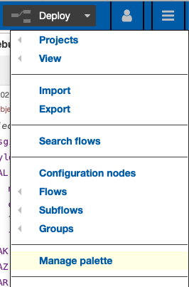
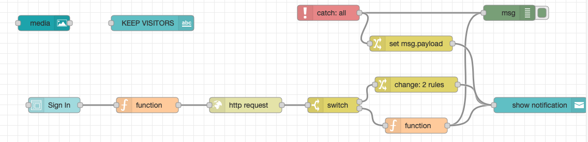
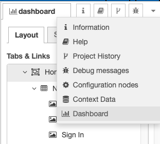
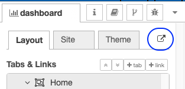

{::options parse_block_html="true" /}

This part of the tutorial will create the Sign In form using Node-RED Dashboard. This requires two new sets of nodes to be added to the palette - the dashboard nodes and the media node.

### New Nodes
1. Click on the menu top-right of Node-RED (the three horizontal lines).
2. Click "Manage Palette". This opens up the window for managing the user settings on the Palette tab.

3. Click on the "Install" tab.
4. In the search bar type "dashboard". This brings up a number of options.
5. Click install against "node-red-dashboard".
6. In the search bar type "media". This brings up a number of options.
7. Click install against "node-red-contrib-ui-media".

The nodes are now ready for the dashboard to be created.

NOTE: The Node-RED dashboard is a single instance displayed for all connected users. So it's appropriate for a visitor's "in-out" application or a central display of metrics. But it's not appropriate for reporting for all managers.
{: .alert .alert-warning}

### New Flow
1. Click on the menu top-right of Node-RED (the three horizontal lines).
2. Click Flows > Add. This will add a new flow to the canvas area.

### Heading Nodes

1. In the **dashboard** category, drag a **media** node onto the canvas. The node does not need wiring to anything.
   - On **Group**, click "Add new ui_group...". Click the pencil. Against Tab click "Add new ui_tab...". Click the pencil. Name the new tab "Home" and click "Add". Name the new group "New Vitisor" and untick "Display group name".
   - Set the Size to "2 x 1".
   - On the Files tab, against Category, click the drop down and select "Add new...". Call it "keep"
   - Click the "Choose Files" button, select the KeepNewIcon.png image downloaded earlier. Click the upload button.
2. In the **dashboard** category, drag a **text** node onto the canvas. The node does not need adding to anything.
   - Select the New Visitor group created in the last step.
   - Set the Size to "6 x 1".
   - Set the Label to "KEEP VISITORS".

### Sign In Form
The Sign in Form will take input and create a document in the visitors database. There are required fields, but there will not be anyt additional validation added. Validation could be added both in the Form Access Mode and/or in Node-RED. Because access to the Domino REST API "visitors" database is not restricted to *only* Node-RED, it's important to have the validation also in the Domino REST API.

1. Drag a **form** node onto the canvas.
   - Select the New Visitor group.
   - Set the Size to "6 x 8"
   - Set the Label to "Sign In"
   - In **Form elements** ensure there are five fields. Values should be:
     - First Name, first_name, Text.
     - Last Name, last_name, Text.
     - Company, company, Text.
     - Time In, time_in, Time.
     - Badge Number, badgeNo, Text
2. Drag a **function** node onto the canvas.
   - On the **On Message** tab enter the JavaScript:
    
    ~~~js
    msg.payload.Form = "Visitor";
    msg.payload.time_out = msg.payload.time_in.substr(msg.payload.time_in.indexOf("T") + 1);
    msg.headers = {
      "Authorization": global.get("AUTH_KEY"),
      "Content-Type": "application/json"
    }
    msg.url = env.get("AUTHENTICATION_HOST") + "/api/v1/document?db=visitors";
    return msg;
    ~~~
    {: .code}
    
    This adds a Form property to the content from the Sign In form and posts the document to Domino REST API.
   -  Wire the form node to this function node.
3. Drag an **http request** node onto the canvas.
   - Change the Method to POST
   - Change the Return to "a parsed JSON object" so that Node-RED will automatically convert the response to a JSON object.
   - Wire the function node to this http request node. 
4. Drag a **switch** node onto this canvas. This is equivalent to a switch statement in various programmatic languages, changing where it routes next depending on a value.
   - Set the Property to msg.statusCode.
   - Set the condition to look for a string 200.
   - Click "+add" to add another condition. Set its value to "otherwise".
   - Wire the http request node to this switch node.
5. Drag a **change** node onto the canvas. This node manipulates variable values. This could be done via a function node, but the change node is being used to display an alternate approach.
   - Change the first Rule to "Set" "msg.topic" to a text value "Success".
   - Click "+add" to add a second rule. Change it to "Set" "msp.payload" to a text value "You are booked in!".
   - Wire the first output from the switch node to this change node.
6. Drag a **function** node onto the canvas.
   - On the **On Message** tab enter the JavaScript:
    
    ~~~js
    msg.topic = "Failed";
    msg.payload = msg.payload.message
    return msg;
    ~~~
    {: .code}
    
    This uses a function node to set values in the same way the 
   -  Wire the second output from the switch node to this function node.
7. Drag a **notification** node onto the canvas.
   - Set Layout to "Bottom Right".
   - Wire the change and function nodes from the last two steps to this notification node.
8. Drag a **catch** node onto the canvas. This does not need wiring to anything.
9. Drag a **debug** node onto the canvas.
   - Set the **Output** to "complete msg object".
   - Wire the catch node to this debug node.
10. Drag a **change** node onto the canvas.
   - Change the rule to "Set" "msg.payload". For the "to" dropdown change it to "msg." and in the input beside that enter "error.message".
   - Wire the catch node to this change node. Wire this change nodse to the notification node.

The flow created so far should look like this:

You can click the Deploy button and test the dashboard. The right-hand sidebar has various tabs with a drop-down to select from all tabs. This allows you to switch to the Dashboard tab. 

Once there, you can click on the launch button to open the dashboard. 
