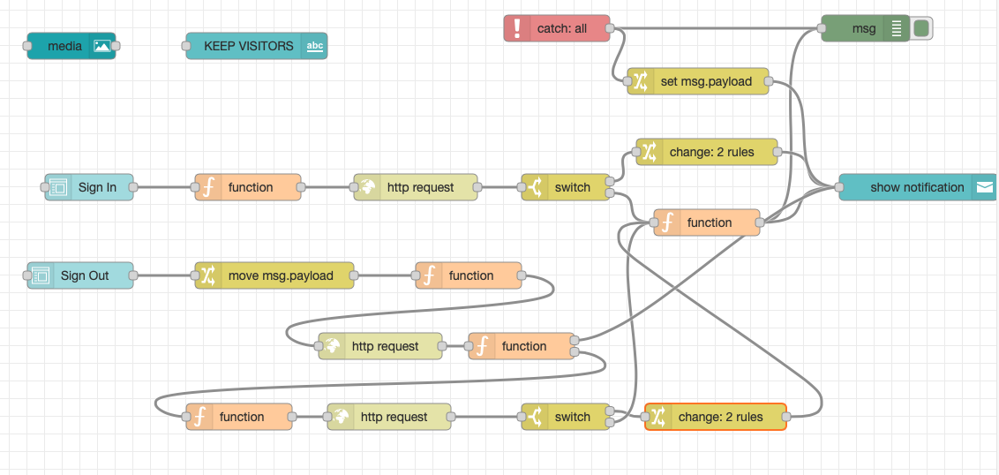

{::options parse_block_html="true" /}

### Sign Out Form
The sign out form doesn't create a document. Instead, it needs to capture a badge number, which will be used to find a Visitor document for the badge number entered, but one *where the time out has not been entered yet*. The "byBadge" view created in the previous part of this tutorial gives that information. It also needs to capture the time the visitor left, and then needs to update that document with that time.

1. Drag a **form** node onto the canvas.
   - Select the New Visitor group.
   - Set the Size to "6 x 8"
   - Set the Label to "Sign Out"
   - In **Form elements** ensure there are two fields. Values should be:
     - Badge Number, badgeNo, Text.
     - Time Out, time_out, Time.
2. Drag a **change** node onto the canvas.
   - Change the first Rule to "Move" "msg.payload" to "msg.badgeUpdate". The payload needs moving because the HTTP request that will be done shortly will overwrite msg.payload.
   - Wire the form node to this change node.
3. Drag a **function** node onto the canvas. This will use the badge number to find the relevant Visitor document.
   - On the **On Message** tab enter the JavaScript:
    
    ~~~js
    msg.headers = {
        "Authorization": global.get("AUTH_KEY")
    }
    msg.url = env.get("AUTHENTICATION_HOST") + "/api/v1/lists/byBadge?db=visitors&key=" + msg.badgeUpdate.badgeNo;
    return msg;
    ~~~
    {: .code}
    
    This adds a Form property to the content from the Sign In form and posts the document to Domino REST API.
   -  Wire the form node to this function node.
4. Drag an **http request** node onto the canvas.
   - Change the Return to "a parsed JSON object" so that Node-RED will automatically convert the response to a JSON object.
   - Wire the function node to this http request node. 
5. Drag a **function** node onto the canvas. The node needs to check on the response and throw errors if the status code is not 200 or no document is found for the badge number. But this is too complex for a simple switch node.
   - Click on the **Setup** tab and change the Outputs to 2.
   - On the **On Message** tab enter the JavaScript:
    
    ~~~js
    if (msg.statusCode == 200) {
        if (msg.payload.length == 0) {
            msg.topic = "Failed";
            msg.payload = "No document found for this badge number";
            return [msg, null];
        }
        return [null, msg];
    }
    msg.topic = "Failed";
    msg.payload = msg.payload.message;
    return [msg, null];
    ~~~
    {: .code}
    
    If the status code was 200, it checks the number of entries returned. If 0, a message is passed to the first output to say the no document was found for the badge number. If successful, the response is passed to the second output. If the status code was not 200, a message is passed to the first output node with the HTTP response message.
   -  Wire the http request node to this function node. Wire the first output from this function node to the notification node.
6. Drag another **function** node onto the canvas. These two steps could have been combined, but for clarity and debugging, they are being split.
   - On the **On Message** tab enter the JavaScript:
    
    ~~~js
    var unid = msg.payload[0]['@unid'];
    msg.headers = {
        "Authorization": global.get("AUTH_KEY"),
        "Content-Type" : "application/json"
    }
    msg.payload = msg.badgeUpdate;
    msg.url = env.get("AUTHENTICATION_HOST") + "/api/v1/document/" + unid + "?db=visitors&mode=default";
    return msg;
    ~~~
    {: .code}
    
    This prepares the HTTP request to update the document, setting the URL to the document update endpoint, passing the UNID received previously and updating the document at the "default" Form Access Mode.
   -  Wire the second output from the previous function node to this function node.
7. Drag an **http request** node onto the canvas.
   - Change the Method to PUT
   - Change the Return to "a parsed JSON object" so that Node-RED will automatically convert the response to a JSON object.
   - Wire the function node to this http request node.
8. Drag a **switch** node onto the canvas.
   - Set the Property to msg.statusCode.
   - Set the condition to look for a string 200.
   - Click "+add" to add another condition. Set its value to "otherwise".
   - Wire the http request node to this switch node. Wire the second output from this node to the function node that follows the switch node from the Sign In form flow.
9. Drag a **change** node onto the canvas.
   - Change the first Rule to "Set" "msg.topic" to a text value "Success".
   - Click "+add" to add a second rule. Change it to "Set" "msp.payload" to a text value "You are booked out!".
   - Wire the first output from the switch node to this change node. Wire the output from this change node to the function node that follows the switch node from the Sign In form flow.

The flow is now complete and should look like this:

You can test the flow using the dashboard.

To improve the robustness, you could add another Form Access Mode specifically for signing out and only accept the time out. You could modify the default mode so that it could only be used to create documents and could not be used to modify documents (hint: if it's not a new document).
{: .advanced}

If you do not get the expected outcome you can use Postman to look at the documents in a view, as we did for the Contacts database. You can also connect the output from a function node (or any other node) to a debug node, to see what the payload was at that point in the flow. This can help diagnose incorrect content or HTTP responses.
{: .troubleshoot}
 