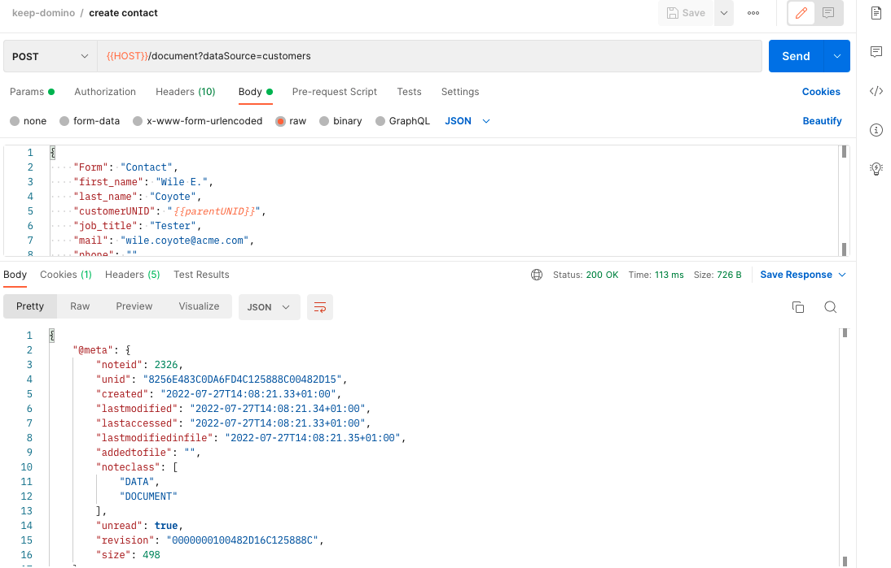

{::options parse_block_html="true" /}

## Contacts

Before creating a contact, you will need to run the "create customer" request again, to have a valid customerUNID in the collection variables to tie the contact to.
{: .alert .alert-warning}
### Create a New Contact ( Document )

1. Hover over the "Domino-REST-API-NewDB" collection name and click on the ellipsis (three dots). Select "Add Request".
2. Name the request "create contact" and click "Save".
3. Change the method from "GET" to "POST".
4. Set the URL as "&#123;&#123;HOST&#125;&#125;/document?dataSource=customers".
5. Set the headers for "Authorization" and "Content-Type".
6. On the Body tab change the type to "Raw".
7. Set the request body content as below, setting the customerUNID field to the **parentUNID** collection variable set when you created a customer:
    
    ~~~json
    {
      "Form": "Contact",
      "first_name": "Marvin",
      "last_name": "Acme",
      "customerUNID": "{{parentUNID}}",
      "job_title": "Chairman",
      "email": "marvin.acme@acme.com",
      "phone": ""
    }
    ~~~
    {: .code}
    
8. Click "Send".
    
9. Save the request.

### Create another New Contact

1. Change the request body content and repeat the step on the "Create Contact" as below:
    
    ~~~json
    {
      "Form": "Contact",
      "first_name": "Wile E.",
      "last_name": "Coyote",
      "customerUNID": "{{parentUNID}}",
      "job_title": "Tester",
      "email": "wile.coyote@acme.com",
      "phone": ""
    }
    ~~~
    {: .code}
    
2. Click "Send".
