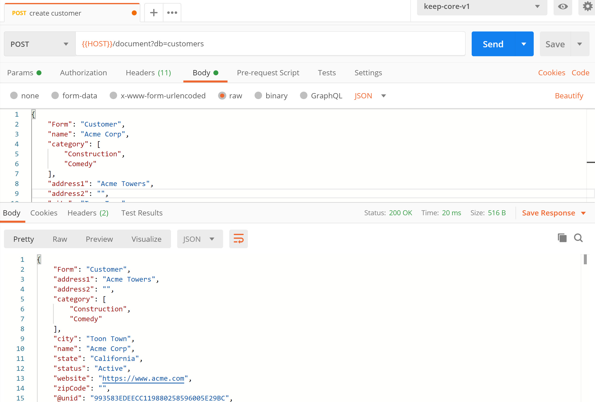
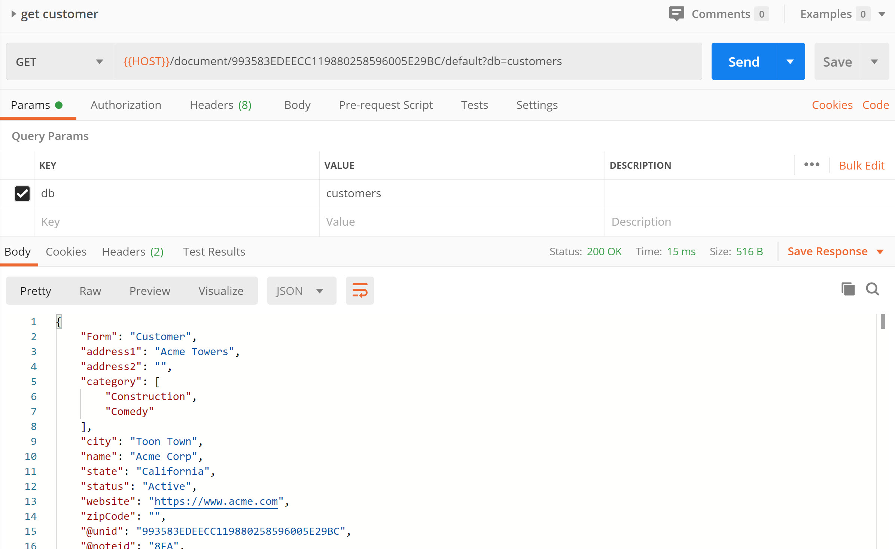
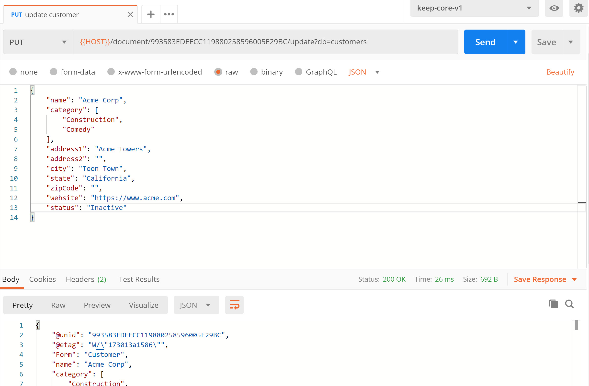
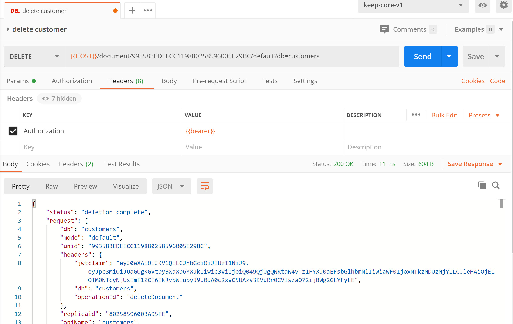

{::options parse_block_html="true" /}

### Create a New Customer

1. Hover over the "keep-domino" collection name and click on the ellipsis (three dots). Select "Add Request".   
1. Name the request "create customer" and click "Save to keep-domino".
1. Change the method from "GET" to "POST".
1. Set the URL as "&#123;&#123;HOST&#125;&#125;/document?db=customers".
1. Set the headers for "Authorization" and "Content-Type".
1. On the Body tab change the type to "Raw".
1. Set the request body content to:
  
  ~~~json
  {
      "Form": "Customer",
      "name": "Acme Corp",
      "category": [
        "Construction",
        "Comedy"
      ],
      "address1": "Acme Towers",
      "address2": "",
      "city": "Toon Town",
      "state": "California",
      "zipCode": "",
      "website": "https://www.acme.com"
  }
  ~~~
  {: .code}
  
1. Click "Send".
1. Save the request.

The customer will be created and the response will include metadata, including **@unid**, which is the reference that will be needed to read, update or delete the customer. We will also need this reference to link the contacts to it.

### Get The Customer

1. Hover over the "keep-domino" collection name and click on the ellipsis (three dots). Select "Add Request".  
1. Name the request "get customer" and click "Save to keep-domino".
1. Set the URL as "&#123;&#123;HOST&#125;&#125;/document/UNID/default?db=customers", replacing UNID with the value for **@unid** you received when creating the customer.
1. Set the headers for "Authorization".
1. Click "Send".
1. Save the request.

### Set The Customer Inactive

1. Hover over the "keep-domino" collection name and click on the ellipsis (three dots). Select "Add Request".  
1. Name the request "update customer" and click "Save to keep-domino".
1. Change the method from "GET" to "PUT".
1. Set the URL as "&#123;&#123;HOST&#125;&#125;/document/UNID/update?db=customers", replacing UNID with the value for **@unid** you received when creating the customer.
1. Set the headers for "Authorization" and "Content-Type".
1. On the Body tab change the type to "Raw".
1. Set the request body content to:
  
  ~~~json
  {
      "Form": "Customer",
      "name": "Acme Corp",
      "category": [
        "Construction",
        "Comedy"
      ],
      "address1": "Acme Towers",
      "address2": "",
      "city": "Toon Town",
      "state": "California",
      "zipCode": "",
      "website": "https://www.acme.com"
  }
  ~~~
  {: .code}
  
1. Click "Send".
1. Save the request.

#### Delete The Customer

1. Hover over the "keep-domino" collection name and click on the ellipsis (three dots). Select "Add Request".  
1. Name the request "delete customer" and click "Save to keep-domino".
1. Set the URL as "&#123;&#123;HOST&#125;&#125;/document/UNID/default?db=customers", replacing UNID with the value for **@unid** you received when creating the customer.
1. Set the headers for "Authorization".
1. Click "Send".
1. Save the request.

Test with different information, to create, update and delete additional customers.
{: .alert .alert-success}