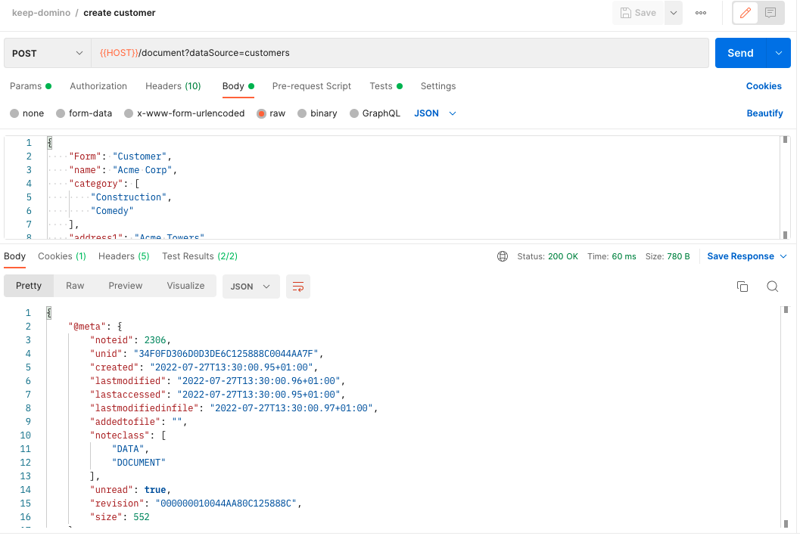
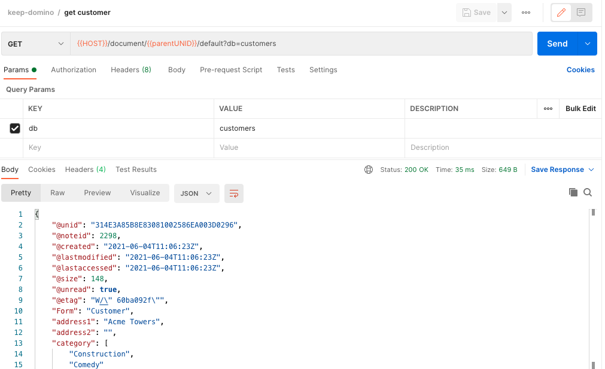
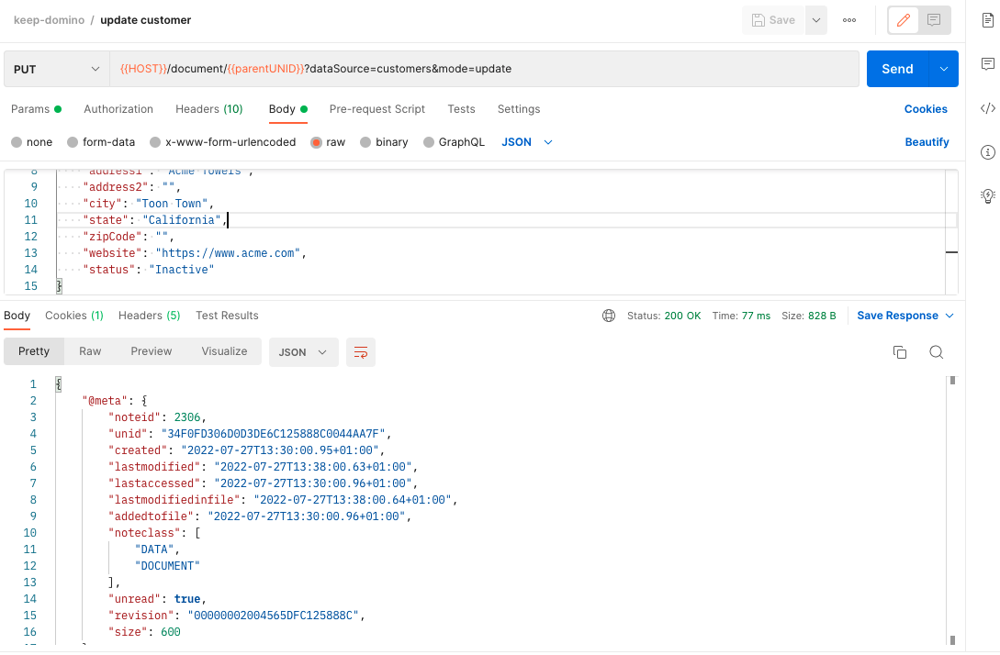
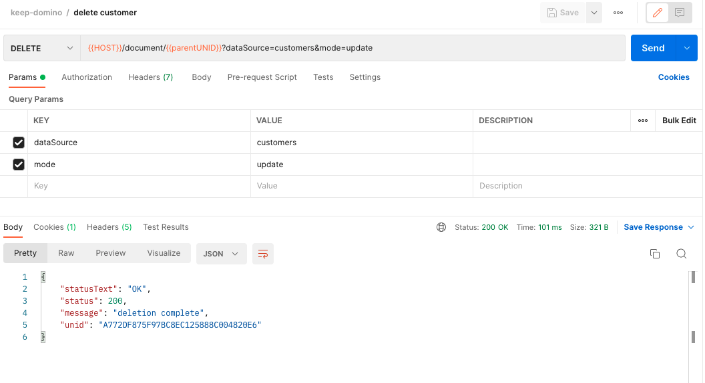

{::options parse_block_html="true" /}

### Create a New Customer

1. Hover over the "keep-domino" collection name and click on the ellipsis (three dots). Select "Add Request".
1. Name the request "create customer" and click "Save to keep-domino".
1. Change the method from "GET" to "POST".
1. Set the URL as "&#123;&#123;HOST&#125;&#125;/document?dataSource=customers".
1. Set the headers for "Authorization" and "Content-Type".
1. On the Body tab change the type to "Raw".
1. Set the request body content to:
    
    ~~~json
    {
      "Form": "Customer",
      "name": "Acme Corp",
      "category": [
        "Construction",
        "Comedy"
      ],
      "address1": "Acme Towers",
      "address2": "",
      "city": "Toon Town",
      "state": "California",
      "zipCode": "",
      "website": "https://www.acme.com"
    }
    ~~~
    {: .code}
    
1. On the Tests tab enter the following content:
    
    ~~~javascript
    pm.test("Status code is 200", function () {
      pm.response.to.have.status(200);
    });
    pm.test("Create ToDo", function () {
      var jsonData = pm.response.json();
      pm.expect(jsonData).to.have.property("@meta");
      pm.expect(jsonData['@meta']).to.have.property("unid")
      pm.collectionVariables.set("parentUNID", jsonData["@meta"].unid);
    });
    ~~~
    {: .code}
    
1. Click "Send".
1. Save the request.

The customer will be created and the response will include metadata, including **@unid**, which is the reference that will be needed to read, update or delete the customer. The tests saved this in the collection variables, so it can be used to link the contacts to it.

### Get The Customer

1. Hover over the "keep-domino" collection name and click on the ellipsis (three dots). Select "Add Request".  
1. Name the request "get customer" and click "Save to keep-domino".
1. Set the URL as "&#123;&#123;HOST&#125;&#125;/document/{{parentUNID}}?dataSource=customers&mode=default". This uses the collection variable set from the value for **@unid** you received when creating the customer.
1. Set the headers for "Authorization".
1. Click "Send".
1. Save the request.

### Set The Customer Inactive

1. Hover over the "keep-domino" collection name and click on the ellipsis (three dots). Select "Add Request".  
1. Name the request "update customer" and click "Save to keep-domino".
1. Change the method from "GET" to "PUT".
2. Set the URL as "&#123;&#123;HOST&#125;&#125;/document/{{parentUNID}}?dataSource=customers&mode=update".
3. Set the headers for "Authorization" and "Content-Type".
4. On the Body tab change the type to "Raw".
5. Set the request body content to:
    
    ~~~json
    {
      "Form": "Customer",
      "name": "Acme Corp",
      "category": [
        "Construction",
        "Comedy"
      ],
      "address1": "Acme Towers",
      "address2": "",
      "city": "Toon Town",
      "state": "California",
      "zipCode": "",
      "website": "https://www.acme.com",
      "status": "Inactive"
    }
    ~~~
    {: .code}
    
1. Click "Send".
1. Save the request.

#### Delete The Customer

1. Hover over the "keep-domino" collection name and click on the ellipsis (three dots). Select "Add Request".  
1. Name the request "delete customer" and click "Save to keep-domino".
1. Set the URL as "&#123;&#123;HOST&#125;&#125;/document/{{parentUNID}}?dataSource=customers&mode=default", replacing UNID with the value for **@unid** you received when creating the customer.
1. Set the headers for "Authorization".
1. Click "Send". You will receive a 403 response.
1. Change the mode query parameter to "update".
1. Click "Send". You will now receive a 200 response.
1. Save the request.

If you get a 403 response when mode is set to "update", check the Form Access Mode for default mode had a "Formula for Delete Access" set to `@True`.
{: .troubleshoot #trouble1}

Test with different information, to create, update and delete additional customers. Test deletion when a Customer is still Active status.
{: .advanced #advanced1}
 
