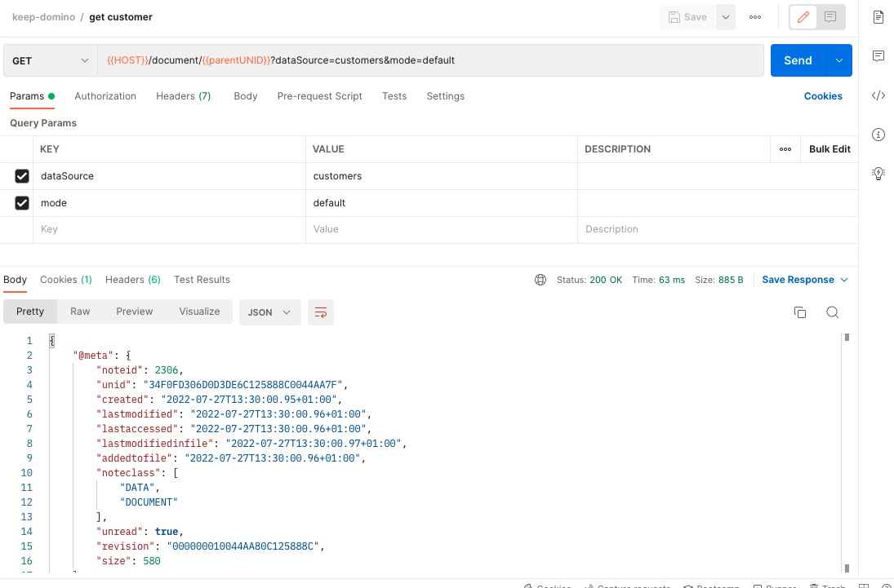

{::options parse_block_html="true" /}

# Customers

Let's now do some basic CRUD with our **Customer** form.

## Create a New Customer

1. Hover over the `Domino-REST-API-NewDB` collection name and click on the ellipsis (three dots). Select **Add Request**.
2. Name the request `create customer` and click **Save**.
3. Change the method from **GET** to **POST**.
4. Set the URL as `{{HOST}}/document?dataSource=customers`.
5. Set the headers for **Authorization** and **Content-Type**.
6. On the **Body** tab change the type to `Raw` and also change the type from `Text` to `JSON`.
7. Set the request body content to:
    
    ~~~json
    {
      "Form": "Customer",
      "name": "Acme Corp",
      "category": [
        "Construction",
        "Comedy"
      ],
      "address1": "Acme Towers",
      "address2": "",
      "city": "Toon Town",
      "state": "California",
      "zipCode": "",
      "website": "https://www.acme.com"
    }
    ~~~
    {: .code}
    
8. On the **Tests** tab enter the following content:
    
    ~~~javascript
    pm.test("Status code is 200", function () {
      pm.response.to.have.status(200);
    });

    pm.test("Create ToDo", function () {
      var jsonData = pm.response.json();
      pm.expect(jsonData).to.have.property("@meta");
      pm.expect(jsonData['@meta']).to.have.property("unid")
      pm.collectionVariables.set("parentUNID", jsonData["@meta"].unid);
    });
    ~~~
    {: .code}
    
9. Click **Send**.
10. **Save** and close the request.

The customer will be created and the response will include metadata (`@meta`), including `unid`, which is the reference that will be needed to read, update or delete the customer. The code we entered earlier in the **Tests** automatically stores this in a variable, making it easier to perform some operations on the last created customer.

## Get The Customer

1. Hover over the `Domino-REST-API-NewDB` collection name and click on the ellipsis (three dots). Select **Add Request**.  
2. Name the request `get customer` and click **Save**.
3. Set the URL as `{{HOST}}/document/{{parentUNID}}?dataSource=customers&mode=default`. This uses the collection variable set from the value for `unid` you received when creating the customer.
4. Set the headers for **Authorization**.
5. Click **Send**.
6. **Save** and close the request.

## Set The Customer Inactive

1. Hover over the `Domino-REST-API-NewDB` collection name and click on the ellipsis (three dots). Select **Add Request**.  
2. Name the request `update customer` and click **Save**.
3. Change the method from **GET** to **PUT**.
4. Set the URL as `{{HOST}}/document/{{parentUNID}}?dataSource=customers&mode=update`.
5. Set the headers for **Authorization** and **Content-Type**.
6. On the **Body** tab change the type to `Raw` and also change the type from `Text` to `JSON`.
7. Set the request body content to:
    
    ~~~json
    {
      "Form": "Customer",
      "name": "Acme Corp",
      "category": [
        "Construction",
        "Comedy"
      ],
      "address1": "Acme Towers",
      "address2": "",
      "city": "Toon Town",
      "state": "California",
      "zipCode": "",
      "website": "https://www.acme.com",
      "status": "Inactive"
    }
    ~~~
    {: .code}
    
8. Click **Send**.
9. **Save** and close the request.

## Delete The Customer

1. Hover over the `Domino-REST-API-NewDB` collection name and click on the ellipsis (three dots). Select **Add Request**.
2. Name the request `delete customer` and click **Save**.
3. Change the method from **GET** to **DELETE**.
4. Set the URL as `{{HOST}}/document/{{parentUNID}}?dataSource=customers&mode=default`.
    

    NOTE
    {: .panel-heading}
    

    `{{parentUNID}}` is the UNID that was saved via the test when the document was created.
    

    

5. Set the headers for **Authorization**.
6. Click **Send**. You will receive a 403 response because the formula for delete access in the `default` mode is `@False`.
7. Change the mode query parameter to `update`.
8. Click **Send**. You will now receive a 200 response. It worked because in the `update` mode, the delete access formula is `status = "Inactive"`, and since we made sure to set the `status` to `Inactive` of our customer in the previous step, the formula checks out. Thus, allowing us to successfully delete it.
9. **Save** and close the request.

If you get a 403 response when mode is set to `update`, check the Form Access Mode for default mode had a **Formula for Delete Access** set to `@True`.
{: .troubleshoot #trouble1}

Test with different information, to create, update and delete additional customers. Test deletion when a **Customer** is still `Active` status.
{: .advanced #advanced1}
 
