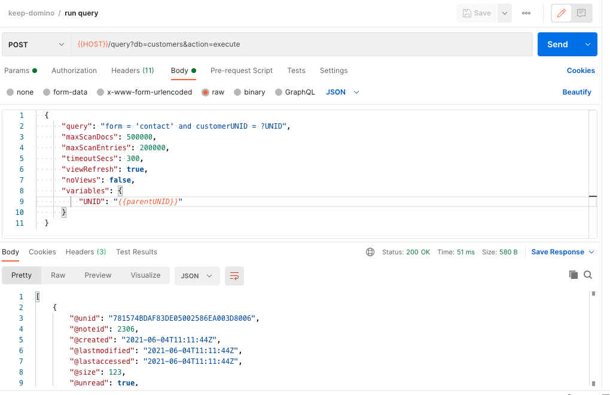

{::options parse_block_html="true" /}

### Querying The Database

We didn't create a list of contacts. But we can run a dynamic query. Of course, performance is not quite as good as for an indexed list.

#### Getting Contacts for a Customer

1. Hover over the "keep-domino" collection name and click on the ellipsis (three dots). Select "Add Request".   
1. Name the request "create contact" and click "Save to keep-domino".
1. Change the method from "GET" to "POST".
1. Set the URL as "&#123;&#123;HOST&#125;&#125;/query?db=customers&action=execute".
1. Set the headers for "Authorization" and "Content-Type".
1. On the Body tab change the type to "Raw".
2. Set the request body content as below, but setting the UNID variable to the value for **@unid** you received when creating the customer:
  
  ~~~json
  {
      "query": "form = 'contact' and customerUNID = ?UNID",
      "maxScanDocs": 500000,
      "maxScanEntries": 200000,
      "timeoutSecs": 300,
      "viewRefresh": true,
      "noViews": false,
      "variables": {
          "UNID": "{{parentUNID}}"
      }
  }
  ~~~
  {: .code}
  
3. Click "Send".
4. Save the request.

You have queried all contacts for the company requested.
{: .alert .alert-success}