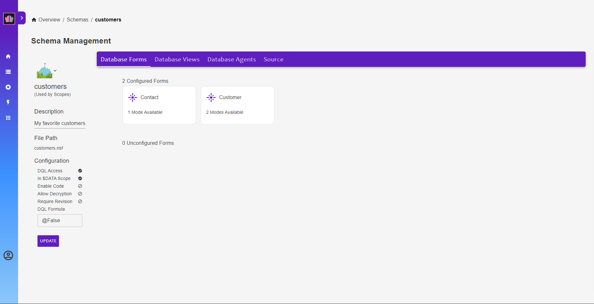

{::options parse_block_html="true" /}

## Add a Form to Configured Forms

1. Click on "customers" in the breadcrumbs to get back to the main schema configuration.
2. Click on the Contact form to configure it. You will be advised that it will automatically be configured as default, select "Yes". Click on Contact to open it to the form access mode.
3. Switch the "Show fields from:" drop-down from "Customer" to "Contact".
4. This will be used for basic CRUD, so select all fields.

Designing the Form does not enforce a schema. By not specifying any fields for Read Access, no fields will be returned by GET requests or accepted for POST requests. 

**Congratulations!**
{: .panel-heading}

This has configured the Contact form for HCL DOMINO REST API access. You should now have both forms configured.

