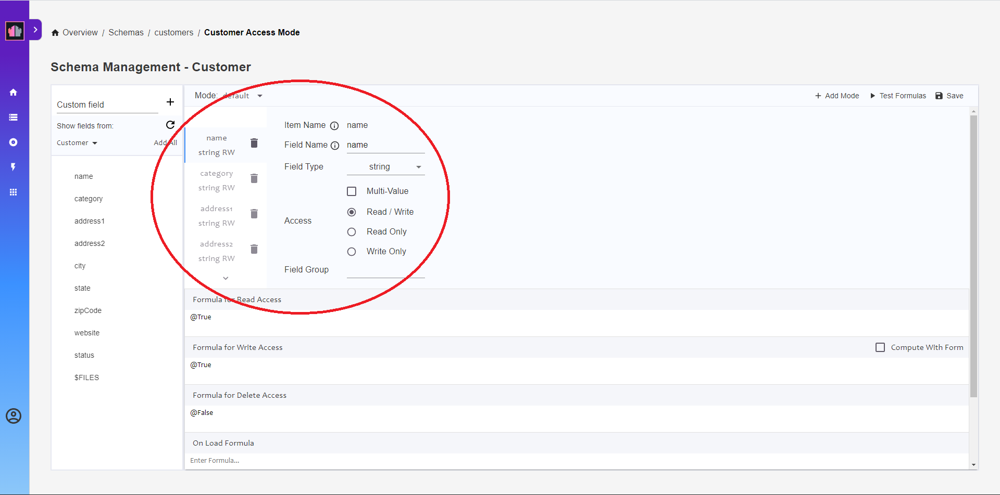

{::options parse_block_html="true" /}

# Customer Form Mode

Click on the **Database Forms** tab. The Customers database has two Forms available for configuration - the two Forms that were created from Postman. In this part,the Customer form will be configured for two different access settings.

## Default Mode

1. Click on the **Customer** Form. You will be prompted that it will be configured as default, select **Yes**. Click to open the Customer form access mode.
2. The Form configuration opens with the default mode open.
    
3. Hover and click the `+` sign against each of the following fields to enable them for read/write access:
    - `name`
    - `category`
    - `address1`
    - `address2`
    - `city`
    - `state`
    - `zipCode`
    - `website` 
    
4. The page should look like this:
    
    The circled area is the main area where we configure the fields we have added.
5. Click on the `+` sign against `status`. Then select that field in the main area and change **Read/Write** to **Read Only**.
6. In the **Formula for Write Access** type `status = ""`. This will prevent write access if given status in a PUT/POST request is not blank.
7. In the **On Save Formula** box type `@SetField("status";"Active")`. This will set the `status` field to be `Active` for new documents.
8. Click on the **Save** button at the top of the default Form Access Mode.

## Update Mode

1. Click on the **+ Add Mode** button.
2. Enter `update` as the mode name for the new mode and click **Save**.
3. Click the `+` sign against all fields to add them.
4. Scroll down to the **Formula for Delete Access**. Change `@False` to `status = "Inactive"`. This ensures that the customer will not be deleted if customer status is not `Inactive` when using the `update` mode.
5. Click on the **Save** button at the top of the Form Access Mode.

The **Formula for Write Access** could be used to ensure only certain options are allowed for the `status` field. Try ensuring only `Active` and `Inactive` are allowed.
{: .advanced}
 

**Congratulations!**
{: .panel-heading}

This has:

- Configured the Customer form for Domino REST API access.
- Ensured the `status` field cannot be set in REST API requests for new documents, but is always set to `Active`.
- Ensured the default Form Access Mode can be used to read documents at any time, but can only be used to create new documents.
- Enabled the `update` Form Access Mode for updating Customer documents.
- Enabled deletion at the `update` Form Access Mode, if the customer `status` is `Inactive`.

