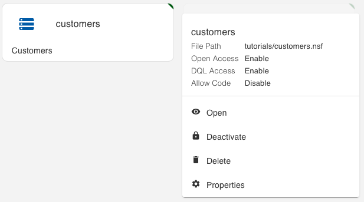

{::options parse_block_html="true" /}

### Form Modes

Form Modes are used to manage access to documents. In order for documents of a specific Form type to be exposed via Keep they need to be:
- Either exposed via one or more Form Modes, in which case the Form Modes define the fields available.
- Or included in a list, in which case the columns in the list are available.

Managing the Form Modes will be done via the Domino KEEP Admin GUI.

### Inspecting Customers
1. Open a browser and go to the Domino KEEP homepage. If you're running Keep locally and with the default ports, this will be "http://localhost:8880. 
2. Click on the Admin GUI link and log in with the same credentials you used for [the authentication steps](../setup/authentication). 
3. Click on the Databases icon. 

1. You will see that the "customers" database is already configured for Keep access. This happened when we created the NSF.
2. Hover on the customers tile and click on the ellipsis. 

1. Click on Properties and review the settings. There is nothing that needs changing at this point.
2. Click out of the tab to close it without changes.

A single NSF can be exposed under different Keep Database names, with different configurations. A typical use case for this is to provide more flexible access for server-to-server communication from Keep Applications, but more restricted access if the application is accessed via JavaScript in a browser.
{: alert alert-info}