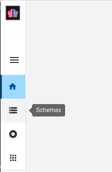

{::options parse_block_html="true" /}

### Form Modes

Form Modes are used to manage access to documents. In order for documents of a specific Form type to be exposed via HCL DOMINO REST API (DRAPI) they need to be:

- Either exposed via one or more Form Modes, in which case the Form Modes define the fields available.
- Or included in a list, in which case the columns in the list are available.

Managing the Form Modes will be done via the DRAPI Admin GUI.

**Form Creation Bug (HCL DOMINO REST API 1.9.x)**
{: .panel-heading}

With versions 1.5.x and 1.6.x there is a bug with the Schema Configuration generated. DRAPI is API-first, so everything that can be done in the REST Configuration UI can also be done, with an appropriately authenticated logon, from any REST Client. So this can quickly be cleared by updating the schema via Postman.

1. Hover over the "get schema" request and click on the ellipsis (three dots). Select "Duplicate".
2. Change the name of the request to "update schema".
3. Change the method from "GET" to "POST".
4. On the Headers tab, add an HTTP request header "Content-Type" set to "application/json".
5. The current schema will be needed to update the schema. Open and run the "get schema" Postman request created earlier. Copy the response.
6. Back on the "update schema" request go to the Body tab. Paste the response from "get schema" into the request body.
7. Delete the "configuredForms" element.
8. Remove the content from the "forms" element, so it is an empty array.
9. Click "Send" to make the request.

### Inspecting Schema Configuration

1. Open a browser and go to the HCL DRAPI homepage. If you're running HCL DRAPI locally and with the default ports, this will be "http://localhost:8880.
2. Click on the REST Configuration UI link and log in with the same credentials you used for [the authentication steps](../setup/authentication).
3. Click on the Schemas icon. 

4. You will see that "customers" already has a schema. This happened when we created the NSF.
5. Click on the customers tile and review the settings.

A single NSF can be exposed with multiple schemas, with different configurations. A typical use case for this is to provide more flexible access for server-to-server communication from HCL DRAPI Applications, but more restricted access if the application is accessed via JavaScript in a browser.
{: alert alert-info}
