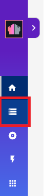

{::options parse_block_html="true" /}

# Form Modes

Form Modes are used to manage access to documents. In order for documents of a specific Form type to be exposed via HCL Domino REST API they need to be:

- Either exposed via one or more Form Modes, in which case the Form Modes define the fields available.
- Or included in a list, in which case the columns in the list are available.

Managing the Form Modes can be done via Domino Rest API Admin UI or an HTTP request. But in this tutorial, we will be configuring Form Modes via admin UI.

## Inspecting Schema Configuration

1. Open a browser and go to the Domino REST API homepage. If you're running API locally and with the default ports, this will be `http://localhost:8880`.
2. Click on the REST Configuration UI link and log in with the same credentials you used for [the authentication steps](../setup/authentication).
3. Click on the schemas icon. 

4. Find `customers` schema.
5. Click on the `customers` tile and review the settings.

A single NSF can be exposed with multiple schemas, with different configurations. A typical use case for this is to provide more flexible access for server-to-server communication from Domino REST API Applications, but more restricted access if the application is accessed via JavaScript in a browser.
{: alert alert-info}
