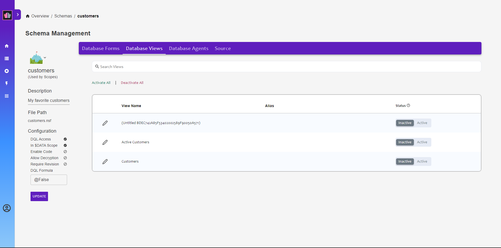

### Database Views

In the breadcrumbs, navigate back to the "customers" schema configuration. Switch to the **Database Views** tab. There are three views - Customers, Active Customers and one without a name. The view without a name is automatically generated when the NSF is created and contains all documents in the database. 

The "Customers" and "Active Customers" views need to be activated so that the data in those views can be accessed. You can do this by clicking on them to add them to the activated views. 

Click "Save" to save the changes.

**Congratulations!**
{: .panel-heading}

Both forms have been configured and the views enabled. Now you are ready to start creating data.

