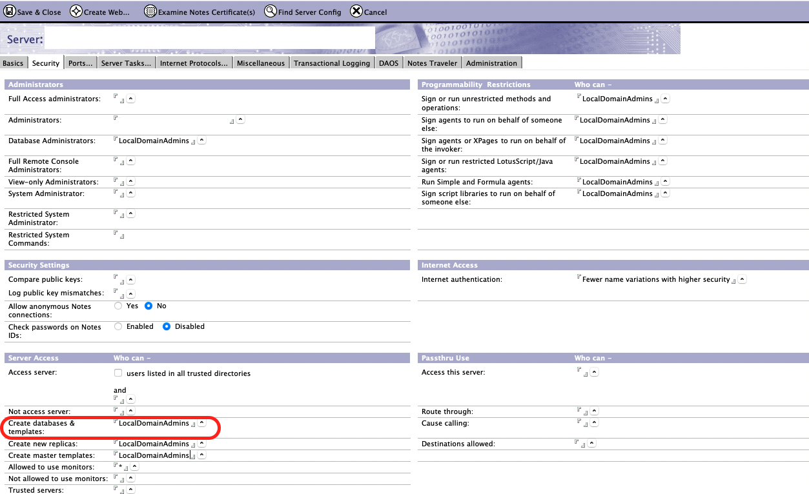

{::options parse_block_html="true" /}

<!-- image here of hcl drapi and not keep -->

## Introduction

HCL Domino REST API (previously known as HCL Project KEEP), provides secure REST API access into HCL Domino. This tutorial will walk you through:  

- Creating a new Domino database.
- Adding Forms for Customers and Contacts.
- Adding Views.
- Configuring it for validated REST API access.
- Updating the access for the database.
Some steps will be done via the Domino REST API Admin UI, some will be done via Postman.

**Note**
{: .panel-heading}

Domino REST API Databases can be left open for REST APIs secured only by user authentication via a JWT token. Alternatively it can be secured only for server-to-server access by approved Domino REST API Applications, in which case all requests not only user authentication via a JWT token but also an application key and secret. In this tutorial, we will only require user authentication via a JWT token.

### Pre-requisites

To run through this tutorial you will need the following:

- An HCL Domino server with Domino REST API running.
- A username and password that has administration access to the server. If you have used the Domino REST API Docker image, you can use the admin username and password you supplied when creating the container.
- The user needs access to create databases on the server. This is controlled by the "Create databases & templates" field on the **Server** tab of the server document.

  This can be set during One-Touch Domino setup by using the appConfiguration/databases/documents to set the CreateAccess item on the Server Document. See [Daniel Nashed's sample](https://github.com/nashcom/domino-startscript/blob/main/OneTouchSetup/first_server.json#L102).
- [Postman](https://www.postman.com/) installed.

**Note**
{: .panel-heading}

Traditionally you would have needed to install the combined HCL Notes, Domino Designer and Domino Administrator client. The browser-based Domino REST API Admin GUI/client will allow complete setup and configuration of databases. But Domino REST API is built "API first", so it can also be done via Postman or extensions could be added to your favourite development IDE.

