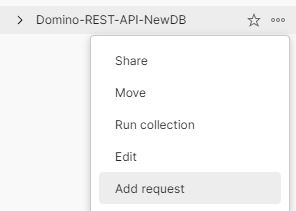

{::options parse_block_html="true" /}

### Postman Authentication

#### Create Collection

1. On the Collections tab, click the "New" button and then select "Collection".
2. In the "New Collection" screen, set the Name as "Domino-REST-API-NewDB".  
3. Switch to the "Variables" tab and add the variables:
   - "HOST" - This should map to the Domino REST API url and should end "/api/v1". For example, if you're running Domino REST API locally and with the default ports, this will be "http://localhost:8880/api/v1".
   - "SETUP_HOST" - This should map to the Domino REST API url and should end "/api/setup-v1". For example, if you're running Domino REST API locally and with the default ports, this will be "http://localhost:8880/api/setup-v1".
4. Click the "Save" button.

#### Create Authentication

1. Hover over the "Domino-REST-API-NewDB" collection name and click on the ellipsis (three dots). Select "Add Request".  

2. Name the request "authenticate".  
3. Change the method from "GET" to "POST".  
4. Set the URL as "&#123;&#123;HOST&#125;&#125;/auth".  
5. On the Headers tab add a header for "Content-Type", set to "application/json".  
6. On the Body tab change the type to "Raw" and enter the username and password as a JSON payload.
7. Click "Send" to make the request.

If you get a 404 message, verify the method is "POST" and the Content-Type header is set correctly. Validation requires these.
{: .troubleshoot #trouble1}

#### Store Bearer Token

1. On the Tests tab add the following code:
    
    ~~~javascript
    var jsonData = pm.response.json();
    pm.collectionVariables.set("bearer", "Bearer " + jsonData.bearer);
    ~~~
    {: .code}
    

    - Line 1 extracts the HTTP response as JSON.
    - Line 2 extract the bearer token from the response and stores it in a collection variable for use in all future authenticated requests.

2. Click "Send" to make the request again.
3. Hover over the "Domino-REST-API-NewDB" collection name and click on the ellipsis (three dots). Select "Edit" and check the Variables tab. You should now see the bearer token also stored.

4. Save and close the request.
