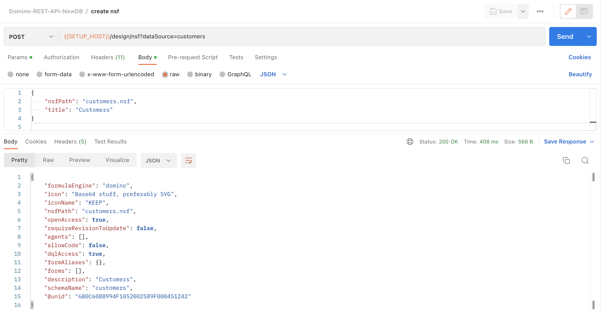

{::options parse_block_html="true" /}

### Create NSF

**Note**
{: .panel-heading}

An **NSF** (Notes Storage Facility) is a repository for data. As a result, it is typically referred to as a Notes database. The design can be inherited from an **NTF** (Notes Template Facility) or can be designed from scratch. We will be doing the latter.

Each NSF has an **ACL** (Access Control List) which manages access to the Notes database, whether for **Users**, **Groups** or **Servers**.

Not all NSFs on the Domino server are exposed via Domino Rest API. You need to explicitly add a **Domino Rest API** configuration (Schema) for an NSF. This defines the alias for Domino REST API requests to use when accessing the database and what kinds of requests are exposed. Creating an NSF via Domino REST API automatically creates the Domino REST API Database configuration for you.

The same NSF can be exposed via multiple Domino REST API Database configurations. This can be useful for exposing a subset of content to a specific audience and enforcing tighter restrictions. This tutorial will not cover creating multiple Domino REST API Database configurations.

1. Hover over the "Domino-REST-API-NewDB" collection name and click on the ellipsis (three dots). Select "Add Request".  
2. Name the request "create nsf" and click "Save".
3. Change the method from "GET" to "POST".
4. Set the URL as "&#123;&#123;SETUP_HOST&#125;&#125;/design/nsf?dataSource=customers".
5. On the Headers tab, add a HTTP request header called "Authorization" with the value "&#123;&#123;bearer&#125;&#125;". This maps to the bearer collection variable we set from the "authenticate" request.
6. Add an HTTP request header "Content-Type" set to "application/json".
7. On the Body tab change the type to "Raw".
8. Set the request body content to:
    
    ~~~json
    {
        "nsfPath": "customers.nsf",
        "title": "Customers"
    }
    ~~~
    {: .code}
    
    

    The "dataSource" query parameter is the Domino REST API Database Schema name you wish to create. The request creates an NSF on the Domino server at the filepath requested, sets up the ACL and creates a Domino REST API Database Schema with default settings.
    {: .why #why1}
9. Click "Send" to make the request.

<!-- wrong screenshot -->
  If you get a 403 response, check to ensure that the user you are authenticated as has access to create databases in the Server document, as covered in the [Prerequisites](../index.html#pre-requisites)
    {: .trouble #trouble1}
10. Save and close the request.

If an NSF already exists at the filepath, this API call will fail. It will also fail if you attempt to pass a Domino REST API Database name as the "dataSource" query parameter.
{: .alert .alert-danger}

### Creating The Schema (If not created via, Create NSF)

1. Hover over the "Domino-REST-API-NewDB" collection name and click on the ellipsis (three dots). Select "Add Request".
2. Name the request "create schema" and click "Save".
3. Change the method from "GET" to "POST".
4. Set the URL as "&#123;&#123;SETUP_HOST&#125;&#125;/schema?configName=customer&nsfPath=customers.nsf".
5. On the Headers tab, add a HTTP request header called "Authorization" with the value "&#123;&#123;bearer&#125;&#125;". This maps to the bearer collection variable we set from the "authenticate" request.
6. Add an HTTP request header "Content-Type" set to "application/json".
7. On the Body tab change the type to "Raw".
8. Set the request body content to:
    
    ~~~json
      {
        "@unid": "6334EDA70A42ABB948258846002F115C",
        "agents": [],
        "allowCode": true,
        "allowDecryption": true,
        "apiName": "customer",
        "description": "Customer database",
        "dqlAccess": true,
        "dqlFormula": {
          "formula": "@True",
          "formulaType": "domino"
        },
        "formAliases": {
          "Customer": "Customer",
          "Entry": "Entry",
          "IdPConfig": "IdP Configuration",
          "OdataSampleForm": "OdataSampleForm",
          "SampleEntry": "SampleEntry",
          "TestForm": "TestForm"
        },
        "forms": [
          {
            "formModes": [
              {
                "computeWithForm": false,
                "deleteAccessFormula": {
                  "formula": "@False",
                  "formulaType": "domino"
                },
                "fields": [
                  {
                    "format": "authors",
                    "name": "Owner",
                    "type": "string"
                  },
                  {
                    "format": "richtext",
                    "name": "Body",
                    "type": "object"
                  },
                  {
                    "items": {
                      "type": "string"
                    },
                    "name": "hobbies",
                    "type": "array"
                  },
                  {
                    "name": "Form",
                    "readOnly": true,
                    "type": "string"
                  },
                  {
                    "name": "Pet",
                    "type": "string"
                  },
                  {
                    "name": "color",
                    "type": "string"
                  },
                  {
                    "name": "email",
                    "type": "string"
                  },
                  {
                    "name": "employee_count",
                    "type": "integer"
                  },
                  {
                    "name": "first_name",
                    "type": "string"
                  },
                  {
                    "name": "last_name",
                    "type": "string"
                  }
                ],
                "modeName": "default",
                "readAccessFormula": {
                  "formula": "@True",
                  "formulaType": "domino"
                },
                "required": [
                  "Form",
                  "email",
                  "first_name"
                ],
                "writeAccessFormula": {
                  "formula": "@True",
                  "formulaType": "domino"
                }
              },
              {
                "computeWithForm": false,
                "deleteAccessFormula": {
                  "formula": "@False",
                  "formulaType": "domino"
                },
                "fields": [
                  {
                    "items": {
                      "type": "string"
                    },
                    "name": "hobbies",
                    "type": "array"
                  },
                  {
                    "name": "Form",
                    "readOnly": true,
                    "type": "string"
                  },
                  {
                    "name": "Pet",
                    "type": "string"
                  },
                  {
                    "name": "color",
                    "type": "string"
                  },
                  {
                    "name": "email",
                    "type": "string"
                  },
                  {
                    "name": "first_name",
                    "type": "string"
                  },
                  {
                    "name": "last_name",
                    "type": "string"
                  }
                ],
                "modeName": "dql",
                "readAccessFormula": {
                  "formula": "@True",
                  "formulaType": "domino"
                },
                "required": [
                  "Form",
                  "email",
                  "first_name"
                ],
                "writeAccessFormula": {
                  "formula": "@True",
                  "formulaType": "domino"
                }
              }
            ],
            "formName": "Customer"
          },
          {
            "formModes": [
              {
                "computeWithForm": false,
                "deleteAccessFormula": {
                  "formula": "@False",
                  "formulaType": "domino"
                },
                "fields": [
                  {
                    "name": "Assets",
                    "type": "string"
                  },
                  {
                    "name": "Country",
                    "type": "string"
                  },
                  {
                    "name": "Form",
                    "readOnly": true,
                    "type": "string"
                  },
                  {
                    "name": "FullName",
                    "type": "string"
                  },
                  {
                    "name": "Industry",
                    "type": "string"
                  },
                  {
                    "name": "Newsletter",
                    "type": "string"
                  },
                  {
                    "name": "email",
                    "type": "string"
                  },
                  {
                    "name": "gender",
                    "type": "string",
                    "writeOnly": true
                  }
                ],
                "modeName": "default",
                "readAccessFormula": {
                  "formula": "@True",
                  "formulaType": "domino"
                },
                "writeAccessFormula": {
                  "formula": "@True",
                  "formulaType": "domino"
                }
              }
            ],
            "formName": "Marketing"
          },
          {
            "formModes": [
              {
                "computeWithForm": false,
                "deleteAccessFormula": {
                  "formula": "@False",
                  "formulaType": "domino"
                },
                "fields": [
                  {
                    "name": "Color",
                    "type": "string"
                  },
                  {
                    "name": "Form",
                    "type": "string"
                  },
                  {
                    "name": "Shape",
                    "type": "string"
                  },
                  {
                    "name": "Taste",
                    "type": "string"
                  }
                ],
                "modeName": "default",
                "readAccessFormula": {
                  "formula": "@True",
                  "formulaType": "domino"
                },
                "writeAccessFormula": {
                  "formula": "@True",
                  "formulaType": "domino"
                }
              },
              {
                "computeWithForm": false,
                "deleteAccessFormula": {
                  "formula": "@False",
                  "formulaType": "domino"
                },
                "fields": [
                  {
                    "name": "Color",
                    "type": "string"
                  },
                  {
                    "name": "Form",
                    "type": "string"
                  },
                  {
                    "name": "Shape",
                    "type": "string"
                  },
                  {
                    "name": "Taste",
                    "type": "string"
                  }
                ],
                "modeName": "odata",
                "readAccessFormula": {
                  "formula": "@True",
                  "formulaType": "domino"
                },
                "writeAccessFormula": {
                  "formula": "@True",
                  "formulaType": "domino"
                }
              }
            ],
            "formName": "SampleForm"
          },
          {
            "formModes": [
              {
                "computeWithForm": false,
                "deleteAccessFormula": {
                  "formula": "@False",
                  "formulaType": "domino"
                },
                "fields": [
                  {
                    "name": "Form",
                    "readOnly": true,
                    "type": "string"
                  },
                  {
                    "name": "colour",
                    "readOnly": true,
                    "type": "string"
                  },
                  {
                    "name": "name",
                    "type": "string"
                  }
                ],
                "modeName": "default",
                "readAccessFormula": {
                  "formula": "@True",
                  "formulaType": "domino"
                },
                "writeAccessFormula": {
                  "formula": "@True",
                  "formulaType": "domino"
                }
              }
            ],
            "formName": "TestForm"
          }
        ],
        "formulaEngine": "domino",
        "icon": "Base64 stuff, preferably SVG",
        "iconName": "mountain",
        "isActive": true,
        "nsfPath": "customers.nsf",
        "openAccess": true,
        "requireRevisionToUpdate": false,
        "schemaName": "demoapi",
        "views": [
          {
            "alias": [
              "($All)"
            ],
            "name": "($All)",
            "unid": "0E35D520A1EBBB5B48258435003E8284"
          },
          {
            "alias": [
              "ChineseCustomers"
            ],
            "name": "ChineseCustomers",
            "unid": "3FE5CD63E179F21600258680006DB25B"
          },
          {
            "alias": [
              "Customers"
            ],
            "name": "Customers",
            "unid": "86C72C1BF64B6DF04825847100373215"
          },
          {
            "alias": [
              "MarketingInfo"
            ],
            "name": "MarketingInfo",
            "unid": "10EA9EC66EA748BC4825851100420810"
          },
          {
            "alias": [
              "Samples"
            ],
            "name": "Samples",
            "unid": "5318911D496571410025860D00544B17"
          }
        ]
    }
    ~~~
    {: .code}
    
        
9. Click "Send" to make the request.
10. Save and close the request.

**Congratulations!**
{: .panel-heading}

This request has:
- Created a new Domino database at the filepath specified.
- Configured it with a default ACL:
    - LocalDomainServers group has Manager access to the database. This means other trusted servers have full access.
    - LocalDomainAdmins group has Manager access to the database. This means all administrators for the server have full access.
    - Default has Editor access to the database. Any authenticated users can create, edit and delete documents.
    - Anonymous users have no access to the database.
    - OtherDomainServers group has no access to the database. Untrusted servers cannot access the database.
- Created a Domino REST API Database Schema configuration under the name "customers" with default settings. REST service access is allowed, DQL (Domino Query Language) can be used by all authenticated users for querying data as well as pre-indexed lists of documents.

