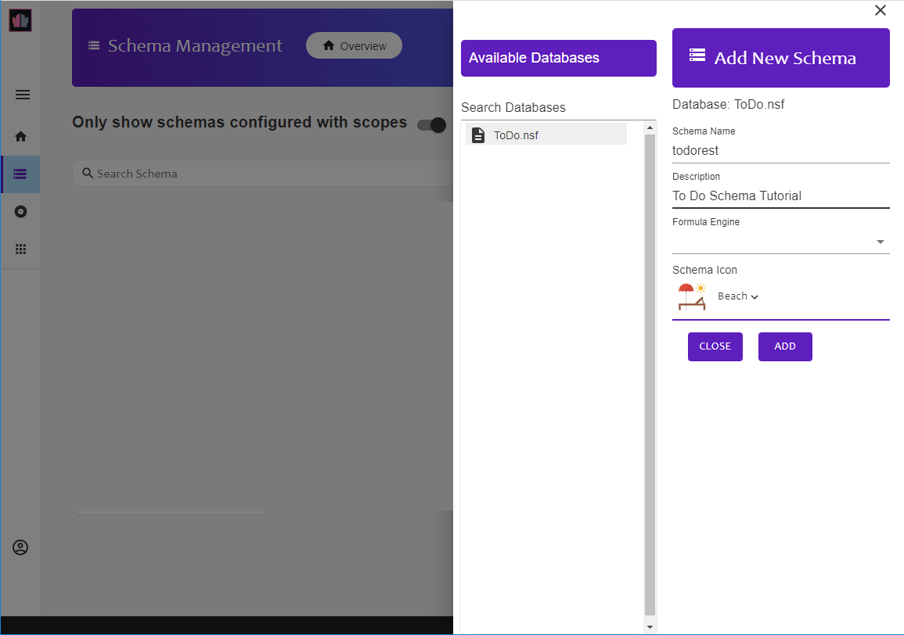

{::options parse_block_html="true" /}

### Keep Admin GUI

#### Domino KEEP Homepage

In a browser, open the Keep homepage. This is "http://" + Domino fully qualified hostname + ":8880/". So if your Domino server is on the same machine, this will be "http://localhost:8880/".

#### Logging In

1. Click on the **Admin GUI** link.
1. Log in with a username and password that has at least Editor access to the Keep Configuration database.
1. You are now on the Domino KEEP admin GUI landing page. You can expand the sidebar by clicking on the hamburger icon.
   
   1. Keep Databases are configurations for an NSF.
   2. Keep Applications allow access to one or more Keep Databases with app ID and app secret in addition to user authentication. This is designed for server-to-server access, where the app ID and app secret are only known to the application making the requests. Examples would be Node-RED nodes, a React application or a Java application. For requests direct from a browser the HTTP request headers can be viewed by the userd, so there is no point adding an app ID or app secret to this.
2. Click on the "Databases" icon.

#### Create To Do Database Configuration
1. Click on the "Create" button.
1. Navigate down to the "IBM XPages ToDo Design App" and verify the filepath is **tutorials\ToDo.nsf**.
   
1. Complete the api name and description. The Api Name cannot include spaces. Select a database icon.
1. Click "CREATE".

You have now created a basic Keep Database configuration. You can access data in the views, but will not be able to interact at document level.
{: .alert .alert-success}