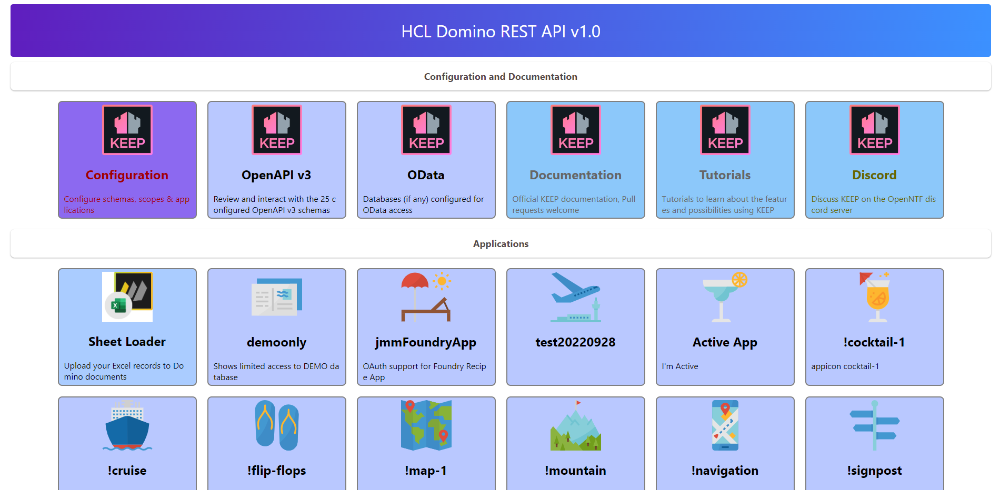
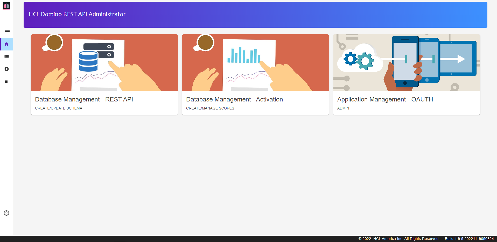

{::options parse_block_html="true" /}

### Domino REST API Admin UI

#### Domino REST API Homepage

In a browser, open the Domino REST API homepage. This is "http://" + Domino fully qualified hostname + ":8880/". So if your Domino server is on the same machine, this will be "http://localhost:8880/".

#### Logging In

1. Click on the **Configuration** link.
1. Log in with a username and password that has at least Editor access to the Domino REST API Configuration database.
1. You are now on the Domino REST API Admin UI landing page. You can expand the sidebar by clicking on the hamburger icon. There are also links in boxes on the landing page.
   
   1. **Database Management - REST API** allows you to define the schema for accessing an NSF. This defines the forms, views and agents exposed.
   1. **Database Management - Activation** manages scopes - whether or not schemas are exposed and under which name.
   1. **Application Management - OAUTH** allow access to one or more Domino REST API Scopes with app ID and app secret in addition to user authentication. This is designed for server-to-server access, where the app ID and app secret are only known to the application making the requests. Examples would be Node-RED nodes, a React application or a Java application. For requests direct from a browser the HTTP request headers can be viewed by the userd, so there is no point adding an app ID or app secret to this.
1. Click on the "Database Management - REST API" box.

#### Schemas and Scopes

Exposing a database with Domino REST API comprises two parts - the **Domino REST API Schema** and the **Domino REST API Scope**.

The **schema** defines _what_ can be exposed and requires an understanding of the database design. It will usually be set up by a developer and is stored as part of the database.

The **scope** defines _whether_ it is exposed and is stored centrally on the server. Depending on the division of responsibilities for the Domino server, this may be done by an administrator or a developer.

#### Create To Do Database Schema Configuration

1. Click on the "+ Add Schema" button.
1. Navigate down to the **ToDo.nsf** and select it.
   
1. Complete the api name and description. The api name cannot include spaces. Select a database icon.
1. Click "CREATE".

NOTE: By default only schemas that have a scope associated will show. You will need to ensure the slider for **Only show schemas configured with scopes** is switched off. See the screenshot for clarification.
{: .alert .alert-info}

You have now created an empty Domino REST API Schema configuration. But you cannot access data in the views, and you will not be able to interact at document level.
{: .alert .alert-success}
