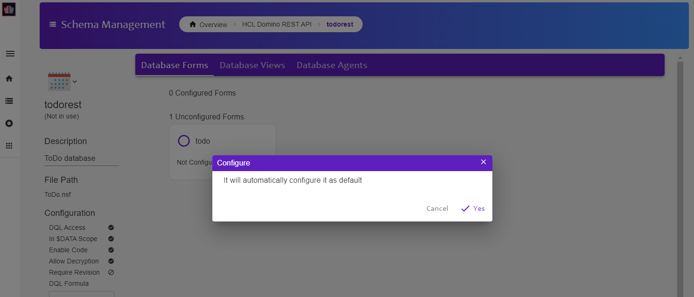
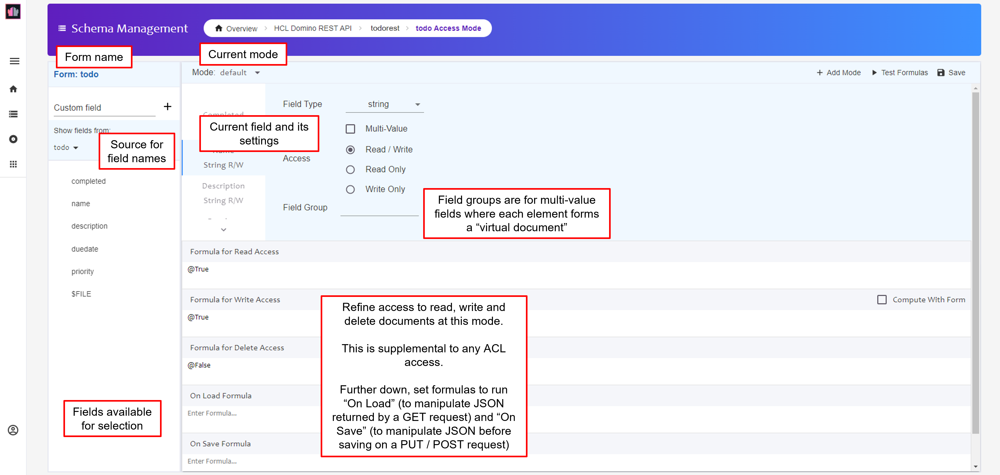

{::options parse_block_html="true" /}

### To Do Database Configuration

#### Review Configuration

1. Hover on the right-hand end of the "todo-keep" tile and click on the ellipsis (three dots).
   
1. Select Properties. You can now view and modify the top-level settings for this Keep Database.
1. There are no agents in the database. So on the "Config" tab click to disable "Allow Code".
1. Review the other tabs.
1. Click the "Update" button.

#### Configure "todo" Form

1. Click on the "todo-keep" tile.
1. On the left-hand side of the page you see an overview of the configuration. On the right-hand side you see the Forms available in the database. If you completed the [Nomad To Do application tutorial](http://paulswithers.github.io/domino_todo/index) you may also see a "dashboard" Form.
1. Click on "todo" form and, when prompted to configure it for default access, click "Yes".
  
1. The "todo" Form will now show as configured, with one mode available.
1. Click on the tile to open it. The Form configuration opens with the default mode open.
   
1. Click the + sign against each of the following and click "Both":
    - name
    - description
    - duedate
    - priority
   
2. Click the + sign against "completed" and click "Read Access".
3. In the "Formula for Delete Access" box type `@False`. This means no one can delete To Dos at this Form Access Mode, regardless of their ACL access.
4. In the "On Save Formula" box type the following:
   
  ~~~
  @SetField("completed";"false");
  @If(@IsNotMember(priority;"High":"Medium":"Low");@SetField("priority";"Low");"");
  ~~~
  {: .code}
  
  This ensures documents created have "completed" set to "false". It also ensures that, if the priority is not a valid value, it will be set to "Low".
1. Click on the "Save" button at the top of the Form Access Mode.

#### Mark-Complete Mode

1. Click on the "+ Mode" button.
1. Enter "change-complete" as the Mode Name for the new mode. The new mode appears behind the "default" mode.
1. Do not add any fields to the "Read Access" area. This will return all fields on the document.
1. Click the + sign against "completed" and click "Write Access".
2. In the "Formula for Write Access" box type the following:
   
  ~~~
  @If(@IsMember(completed;"true":"false");@True;@False);
  ~~~
  {: .code}
  
  This fails validation if "completed" is not "true" or "false". It will not allow any other fields to be updated.
1. Click on the "Save" button at the top of the Form Access Mode.

**Congratulations!**
{: .panel-heading}

This has configured the To Do form for Keep access, with two Form Modes. One is for updating various the To Do. The other can only be used for marking completed or not completed.

**NOTE**
{: .panel-heading}

An NSF can be exposed via multiple Keep Database configurations, with different settings. This is particularly useful for obfuscating access to administrative areas or exposing DQL access only for server-to-server access via Keep Application configurations.

