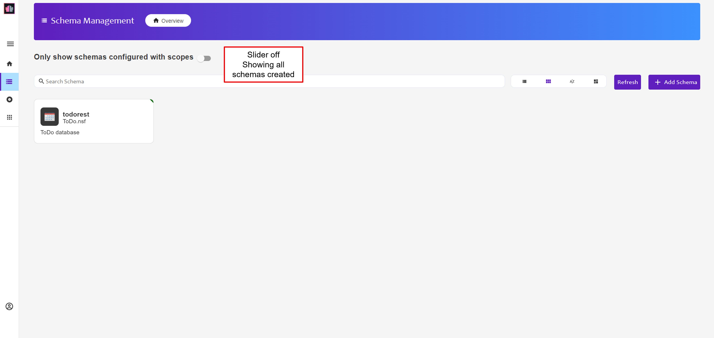

{::options parse_block_html="true" /}

### To Do Database Schema Configuration

#### Review Configuration

1. Ensure the slider against **Only show schemas configured with scopes** is switched off.
1. Click on the "todo-keep" tile.
   
1. You can now view and modify the settings for this Keep Schema. On the left-hand side of the page you see an overview of the configuration. On the right-hand side you can configure Database Forms, Database Views and Database Agents.
1. There are no agents in the database. So in the "Configuration" area click to disable "Enable Code". There is also no encrypted field content, so disable "Allow Decryption".
1. Click the "Update" button.
1. Click on the "Database Views" tab. No views are currently activated. Views will be activated later. This does not prevent documents being created.

#### Configure "todo" Form

1. On the left-hand side of the page you see an overview of the configuration. On the right-hand side you see the Forms available in the database. If you completed the [Nomad To Do application tutorial](http://paulswithers.github.io/domino_todo/index) you may also see a "dashboard" Form.
1. Click on "todo" form and, when prompted to configure it for default access, click "Yes".
  
1. The "todo" Form will now show as configured, with one mode available.
1. Click on the tile to open it. The Form configuration opens with the default mode open.
   
1. Click the + sign against each of the following and click "Read / Write":
    - name
    - description
    - duedate
    - priority
   The "duedate" field will automatically set Field Type to "Date-Time"
   
2. Click the + sign against "completed" and click "Read Only". De-select "Multi-Value". Although the field is defined as multi-value in the design, it does not make sense to accept multiple values.
3. Ensure the "Formula for Delete Access" box has `@False`. This means no one can delete To Dos at this Form Access Mode, regardless of their ACL access.
4. Scroll down to the "On Save Formula" box and type the following:
   
  ~~~
  @SetField("completed";"false");
  @If(@IsNotMember(priority;"High":"Medium":"Low");@SetField("priority";"Low");"");
  ~~~
  {: .code}
  
  This ensures documents created have "completed" set to "false". It also ensures that, if the priority is not a valid value, it will be set to "Low".
1. Click on the "Save" button at the top of the Form Access Mode.

#### Mark-Complete Mode

1. Click on the "+ Add Mode" button.
1. Enter "change-complete" as the Mode Name for the new mode. The new mode replaces the "default" mode, with a drop-down to switch between the modes.
1. Select all fields. Set "completed" to "Read / Write" but all other fields to "Read only". De-Select "Multi_Value" for the "completed" field.
3. Click on the "Save" button at the top of the Form Access Mode.

Write Access formulas are tested based on the last saved state of the document, so cannot be used for validation of the current payload. Domino KEEP does allow you to set validation rules for a Form Access Mode, but this tutorial does not cover that.
{: .alert .alert-info}

**Congratulations!**
{: .panel-heading}

This has configured the To Do form for Domino REST API access, with two Form Modes. One is for updating various the To Do. The other can only be used for marking completed or not completed.

**NOTE**
{: .panel-heading}

An NSF can be exposed via multiple Domino REST API Database configurations, with different settings. This is particularly useful for obfuscating access to administrative areas or exposing DQL access only for server-to-server access via Domino REST API Application configurations.

