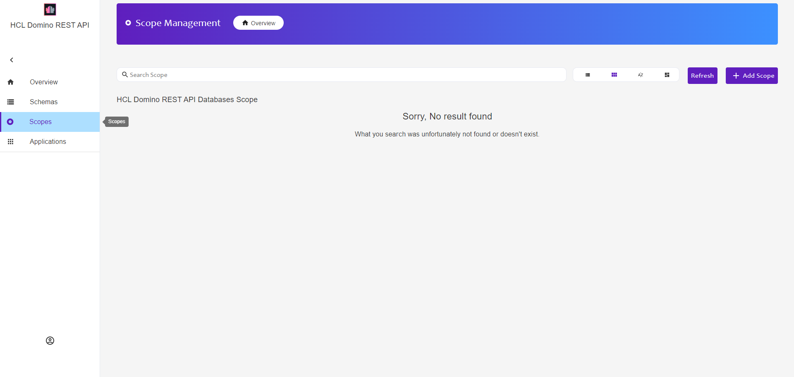

{::options parse_block_html="true" /}

The To Do database has been configured with a **schema** to define _what_ we want to make available, but it has not yet been configured with a **scope** to define _where_ it is available. That is the next step.

### To Do Database Scope

1. In the left-hand navigation, click on "Scopes" (the "target" icon).
   
1. Click on the "+ Add Scope" button.
1. Expand **ToDo.nsf** and select the **todokeep** schema.
1. Set the scope name to **todokeep**. A scope name does not have to be the same as the schema name. Having the same scope and schema name may make it easier to manage when lots of schemas have been set up. But it requires greater forethought to ensure uniqueness.
    - The schema name only has to be unique for each database, only internal and just for developers and administrators managing Domino REST API.
    - The scope name has to be unique for all NSFs on the server, is visible to people consuming the REST APIs and will appear as the query string parameter to access the database via Domino REST API.
1. Complete the other details, leaving the tick in "Active". If active, the scope and schema can be used from REST clients and anything that can make REST requests.

**Some Thoughts on Schema and Scope Names**
{: .panel-heading}

In some scenarios, a third-party solution may only be accessing data from a single NSF. In this scenario, using a single schema name and scope may make most sense.

But in other scenarios, a CRM application may comprise a suite of NSFs. For simplicity, the schemas may all just be the name of the non-Domino solution, e.g. "mycrm". But the scopes need to be unique, so might be named "mycrmcustomers", "mycrmcorresp" etc.

In other scenarios there may be a central database of keywords, departments, product names etc that multiple NSFs all use as a source for field selection options. It may make sense to use a single schema and scope for multiple non-Domino solutions.

Security may also be a consideration. If the schema has "Open Access" enabled, any authorised logon from any REST service call can access the scope. If a solution is making REST requests direct from the browser rather than server-side, it's not hard to find the URLs being called. If a particularly curious end user finds a URL pointing to a Domino REST API scope "crm2", they might try other numbers as well.

So there may be a variety of factors that might incline towards different strategies for different scenarios.

You have now created a Domino REST API Schema and Domino REST API scope and can now interact with the data.
{: .alert .alert-success}
