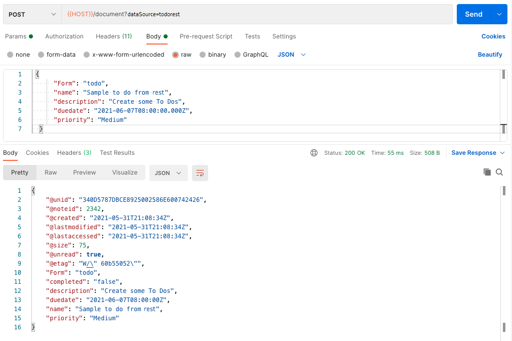

{::options parse_block_html="true" /}

### Create ToDos

#### Create ToDo

1. Hover over the "keep-notes" collection name and click on the ellipsis (three dots). Select "Add Request".   
1. Name the request "create todo" and click "Save to keep-notes".
1. Change the method from "GET" to "POST".
1. Set the URL as "&#123;&#123;HOST&#125;&#125;/document?db=todo-keep".
1. Set the headers for "Authorization" and "Content-Type".
1. On the Body tab change the type to "Raw".
1. Set the request body content to:
  
  ~~~json
  {
      "Form": "todo",
      "name": "Sample to do from Keep",
      "description": "Create some To Dos",
      "duedate": "2021-06-07T08:00:00.000Z",
      "priority": "Medium"
  }
~~~
  {: .code}

1. On the Test tab add the following test:
 
 ~~~javascript
 {
   pm.test("Status code is 200", function () {
    pm.response.to.have.status(200);
});
pm.test("Create ToDo", function () {
    var jsonData = pm.response.json();
    pm.expect(jsonData).to.have.property("@unid");
    pm.collectionVariables.set("UNID", jsonData["@unid"]);
});
 }
~~~
  {: .code}

1. Click "Send".

The ToDo will be created and the created document returned back. Note that it now has "completed" set to "false" and an @unid. Take a copy of this, we will need it later to update the document.
   

#### Bad Requests

1. Change the priority to "foo".
1. Click "Send" and note that the ToDo is created, but the priority set to "Low", as defined by the "On Save Formula".
1. Save the request.

#### Mark Complete / Incomplete

1. Hover over the "keep-notes" collection name and click on the ellipsis (three dots). Select "Add Request".   
2. Name the request "change complete" and click "Save to keep-notes".
3. Change the method from "GET" to "POST".
4. Set the URL as "&#123;&#123;HOST&#125;&#125;/document/{{UNID}}/change-complete?db=todo-keep". The "create todo" request added a test that saved the UNID of the created document to the collection variables, so we can just reference that in the URL.
5. Set the headers for "Authorization" and "Content-Type".
6. On the Body tab change the type to "Raw".
7. Set the request body content to:
  
  ~~~json
  {
      "completed": "true"
  }
  ~~~
  {: .code}
  
8. Click "Send".
9. Save the request.

#### Bad Request

1. Add another field to the payload "foo" with the value "bar".
2. Click Send. You will receive an error that invalid data has been submitted, and you need to remove "foo".