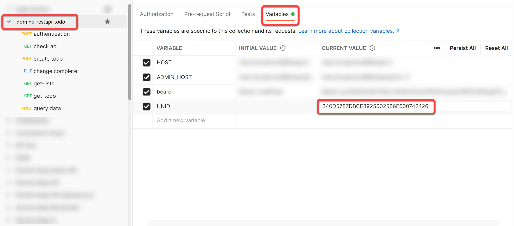

{::options parse_block_html="true" /}

### Create ToDos

#### Create ToDo

1. Hover over the "domino-restapi-todo" collection name and click on the ellipsis (three dots). Select "Add Request".
2. Name the request "create todo" and click "Save to domino-restapi-todo".
3. Change the method from "GET" to "POST".
4. Set the URL as "&#123;&#123;HOST&#125;&#125;/document?dataSource=todorest".
5. Set the headers for "Authorization" and "Content-Type".
6. On the Body tab change the type to "Raw".
7. Set the request body content to:
    
    ~~~json
    {
      "Form": "todo",
      "name": "Sample to do from rest",
      "description": "Create some To Dos",
      "duedate": "2021-06-07T08:00:00.000Z",
      "priority": "Medium"
    }
    ~~~
    {: .code}
    
8. A future REST service will update the To Do. Instead of manually setting the UNID each time, JavaScript code can be run in a test to extract the UNID from the response and store it in a collection variable. On the Test tab add the following test:
    
     ~~~javascript
pm.test("Status code is 200", function () {
    pm.response.to.have.status(200);
});
pm.test("Create ToDo", function () {
    var jsonData = pm.response.json();
    pm.expect(jsonData).to.have.property("@meta");
    pm.expect(jsonData['@meta']).to.have.property("unid")
    pm.collectionVariables.set("UNID", jsonData["@meta"].unid);
});
    ~~~
    {: .code}
    
    Lines 1 - 3 is a test to check whether the creation was successful and a 200 HTTP status returned. Lines 4 - 8 is a test to look for an **@unid** property in the returning JSON. Line 5 extracts that JSON from the response. Line 6 checks it has an **@unid** property. Line 7 stores the value into an **UNID** collection variable.
1. Click "Send".

The ToDo will be created and the created document returned back. Note that it now has "completed" set to "false" and an @unid.
   

Click on the "domino-restapi-todo" collection and click on the Variables tab. You will see UNID has now been set with a value.
   

#### Bad Requests

1. Change the priority to "foo".
1. Click "Send" and note that the ToDo is created, but the priority set to "Low", as defined by the "On Save Formula".
1. Save the request.

#### Mark Complete / Incomplete

1. Hover over the "domino-restapi-todo" collection name and click on the ellipsis (three dots). Select "Add Request".
2. Name the request "change complete" and click "Save to domino-restapi-todo".
3. Change the method from "GET" to "PUT".
4. Set the URL as "&#123;&#123;HOST&#125;&#125;/document/&#123;&#123;UNID&#125;&#125;?dataSource=todorest&mode=change-complete". The "create todo" request added a test that saved the UNID of the created document to the collection variables, so we can just reference that in the URL.
5. Set the headers for "Authorization" and "Content-Type".
6. On the Body tab change the type to "Raw".
7. Set the request body content to:
  
  ~~~json
  {
      "Form": "todo",
      "completed": "true"
  }
  ~~~
  {: .code}
  
1. Click "Send".
2. Save the request.

#### Bad Request

1. Remove the "Form" element from the request body JSON object.
1. Click Send. A HTTP 400 status (Bad Request) will be returned, saying that the provided object shopuld contrain property Form.

1. Add another field to the payload "foo" with the value "bar".
1. Click Send. The field "foo" will have been ignored.
