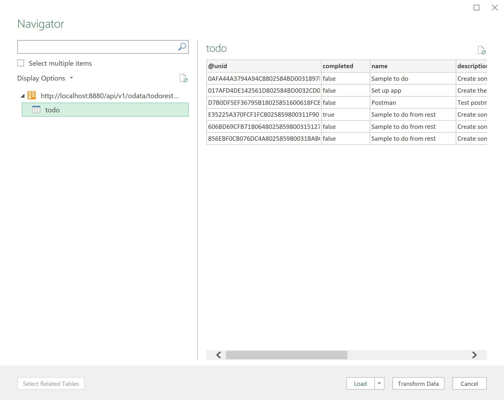

{::options parse_block_html="true" /}

### Viewing Data in Excel

#### Set Up OData Feed

**NOTE:** OData Feed access only works in Excel on Windows. The functionality is not included in Excel for Mac.
{: .alert .alert-danger}

1. Launch Excel and open a new Workbook.
1. On the Data tab, click on Get Data > From Other Sources > From OData Feed.

1. In the dialog box, enter the URL mapping to the Domino KEEP OData endpoint at "/api/v1/odata/todo-keep". So if your Domino server is on the same machine, this will be "http://localhost:8880/api/v1/odata/todo-keep".
1. In the Navigator window, click on "todo"

1. Click "Load".

You now have live data from Domino! Let's prove it.
{: .alert .alert-success}

#### Update The Data

1. Return to Postman and go to the "create todo" request.
1. Change the values as required and create a new ToDo.
1. Switch back to Excel and, on the Query tab, click the "Refresh" button.

Excel is updated with the live data!
{: .alert .alert-success}

#### Create a Chart

1. On the Insert tab click the "Recommended Charts" button.
1. Choose the "Count of @unid by priority" chart.
1. Click OK.

You now have a chart from your Domino data!
{: .alert .alert-success}