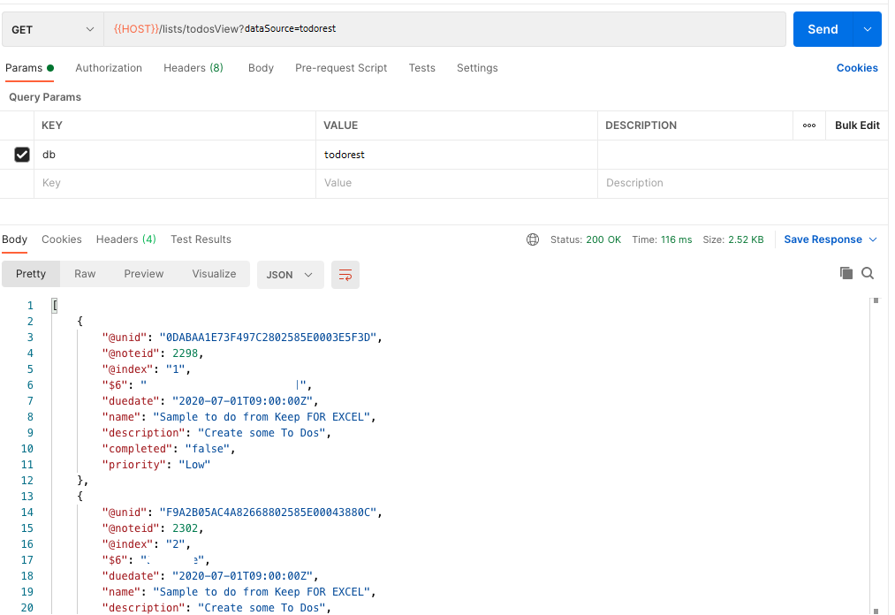

{::options parse_block_html="true" /}

### Lists

Lists correspond to your Domino views and are lists of documents.

By default, no lists will be exposed. You need to choose which views should be accessible.
{: .alert .alert-info}

#### Configure Lists

Back in the Keep Web GUI, access the todokeep Keep Database again. This time, switch from "Database Forms" to "Database Views". Select all views.

Remember to click "Save" to submit the changes.

#### Show Available Lists

1. Hover over the "keep-notes" collection name and click on the ellipsis (three dots). Select "Add Request".
1. Name the request "get-lists" and click "Save to keep-notes".
1. Set the URL as "&#123;&#123;HOST&#125;&#125;/lists?dataSource=todo-keep".
1. Set the headers for "Authorization".
1. Click "Send". You will get a list of all views available in the database. Domino KEEP allows you to exclude access to certain views.
   
1. Save and close the request.

#### Get Entries from a View

1. Hover over the "keep-notes" collection name and click on the ellipsis (three dots). Select "Add Request".
1. Name the request "get-todo" and click "Save to keep-notes".
1. Set the URL as "&#123;&#123;HOST&#125;&#125;/lists/todosView?db=todo-keep".
1. Set the headers for "Authorization".
1. Click "Send". You will get a list of entries in the view. The request can be refined with various querystring parameters:
   1. **count** specifies the number of entries to return.
   1. **start** specifies the number of entries entries to skip in a view
   1. **documents** set to `true` returns the full document data, using the "default"  Form Access Mode.
   1. **mode** can select the mode to display, only applicable if `documents` is set to true.
   
1. Save and close the request.

By default, the column values are returned. This will include hidden columns, because visibility settings are being defined for the Notes Client. Keep is designed for API access for other developers, not for end users. However, if `documents` is set to true, then the column values will be replaced with the fields on the underlying document as defined by the mode.
{: .alert .alert-info}
