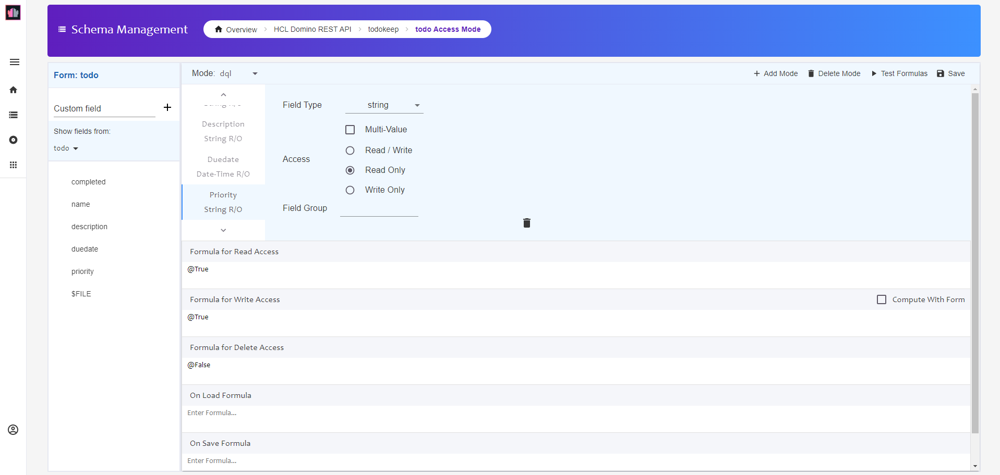

{::options parse_block_html="true" /}

### DQL Queries

If configuration allows DQL, you can also perform DQL queries against an NSF. A form has to have a mode with the name `dql`, otherwise documents with that Form are excluded from search results.

### Set Up dql Mode

Back in the Domino REST API Admin UI, access the todokeep Domino REST API Database again. 

1. Open the "todo" form and click "+ Add Mode".
1. Set the mode name as `dql` and click "Save".
1. Add all fields, setting them all to Read Only.
   
1. Click Save.

#### Run a Query

1. Hover over the "keep-notes" collection name and click on the ellipsis (three dots). Select "Add Request".
1. Name the request "query data" and click "Save to keep-notes".
1. Change the method from "GET" to "POST".
1. Set the URL as "{{HOST}}/query?action=execute&dataSource=todokeep".
1. Set the headers for "Authorization" and Content-Type.
1. On the Body tab change the type to "Raw".
1. Set the request body content to:
    
    ~~~json
    {
      "query": "form = 'todo' and completed = ?STATUS",
      "maxScanDocs": 500000,
      "maxScanEntries": 200000,
      "timeoutSecs": 300,
      "viewRefresh": true,
      "noViews": false,
      "variables": {
          "STATUS": "false"
      }
    }
    ~~~
    {: .code}
    
1. Click "Send". You will get a list of documents matching the query in the database.
   
1. Save and close the request.

You request can be refined with `count` and `start` parameters, as with views.
{: .alert .alert-info}