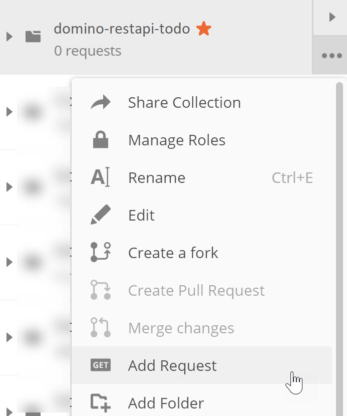
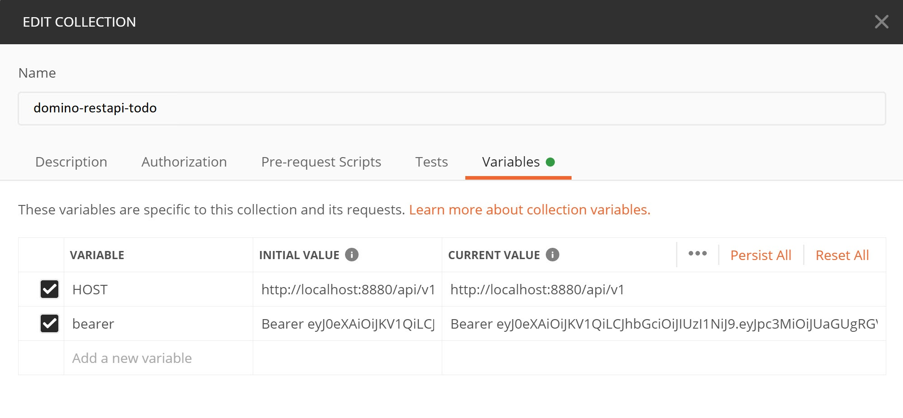

{::options parse_block_html="true" /}

### Postman Authentication

#### Create Collection
1. On the Collections tab, click the "New Collections" button.  
1. In the "CREATE A NEW COLLECTION" dialog, set the Name as "keep-notes".  
1. On the Variables tab of the dialog, add a new variable called "HOST". This should map to the Domino KEEP API url and should end "/api/v1". Keep is running on the same URL as your Domino server, just on port 8880 instead of port 80. So, for example, if your Domino server is on the same machine, this will be "http://localhost:8880/api/v1". If your Domino server is at http://apps1.acme.com, the URL you will need will be http://apps.acme.com:8880/api/v1. 
1. Add another variable called ADMIN_HOST. Accessing an ACL is done via a different OpenAPI, so the end of the URL is slightly different. This time it should end "/api/admin-v1". So, for example, if HOST was set as "http://localhost:8880/api/v1", this will be "http://localhost:8880/api/admin-v1".
1. Click "Create".

#### Create Authentication
1. Hover over the "keep-domino" collection name and click on the ellipsis (three dots). Select "Add Request".  

1. Name the request "authenticate" and click "Save to keep-notes".  
1. Change the method from "GET" to "POST".  
1. Set the URL as "&#123;&#123;HOST&#125;&#125;/auth".  
1. On the Headers tab add a header for "Content-Type", set to "application/json".  
1. On the Body tab change the type to "Raw" and enter the username and password as a JSON payload.
1. Click "Send" to make the request.

If you get a 404 or 405 message, verify the method is "POST" and the Content-Type header is set correctly. Validation requires these.
{: .troubleshoot #trouble1}

#### Store Bearer Token
1. On the Tests tab add the following code:
    
    ~~~javascript
    var jsonData = pm.response.json();
    pm.collectionVariables.set("bearer", "Bearer " + jsonData.bearer);
    ~~~
    {: .code}
    
    Line 1 extracts the HTTP response as JSON. Line 2 extract the bearer token from the response and stores it in a collection variable for use in all future authenticated requests.
1. Click "Send" to make the request again.
1. Hover over the "keep-notes" collection name and click on the ellipsis (three dots). Select "Edit" and check the Variables tab. You should now see the bearer token also stored.

1. Save and close the request.

The bearer token expires after one hour, so be ready to regenerate it if you need to.
{: .alert .alert-info}